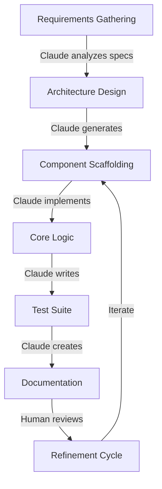
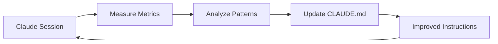

# CLAUDE.md: The Definitive Standard for Claude-Powered Agentic Development

## Executive Summary

CLAUDE.md is a specialized adaptation of the AGENTS.md standard, designed specifically for Claude's unique capabilities, constraints, and interaction patterns. This document establishes best practices for leveraging Claude as an autonomous coding agent while maintaining code quality, consistency, and development velocity.

### Key Differentiators from Generic AGENTS.md
- **Context-Aware Memory Management**: Optimized for Claude's 200k token context window
- **Artifact-First Development**: Leverages Claude's native artifact generation capabilities
- **Multi-Tool Orchestration**: Integrates Claude's web search, file operations, and computational tools
- **Ethical Boundaries**: Incorporates Claude's safety guidelines into development workflows

## 1. Core Principles for Claude-Based Agentic Development

### 1.1 The Four Pillars of Claude Agentic Coding

#### **Conversational Autonomy**
Claude excels at maintaining context through natural dialogue. Unlike rigid command-based systems, Claude interprets intent and adapts execution strategies dynamically.

```markdown
# Good Claude Instruction
"Refactor the authentication module to use OAuth 2.0, ensuring backward compatibility with existing JWT tokens"

# Less Effective
"Execute: refactor_auth --oauth2 --backward-compat"
```

#### **Iterative Refinement**
Claude's strength lies in iterative problem-solving with human feedback loops. Design workflows that embrace refinement rather than expecting perfect first-pass solutions.

#### **Contextual Intelligence**
Claude maintains sophisticated understanding across conversation turns. Leverage this by building context gradually rather than front-loading all requirements.

#### **Safety-Conscious Development**
Claude inherently avoids generating malicious code, making it ideal for security-sensitive development. Structure requests to align with these guardrails.

### 1.2 Claude-Specific Capabilities Matrix

| Capability | Claude Strength | Implementation Strategy |
|------------|-----------------|------------------------|
| **Code Generation** | Excellent across 50+ languages | Provide clear specifications with example patterns |
| **Architecture Design** | Strong systems thinking | Request architectural diagrams alongside code |
| **Debugging** | Exceptional error analysis | Share full error traces and context |
| **Documentation** | Native markdown expertise | Request inline docs with code generation |
| **Testing** | Comprehensive test coverage | Ask for tests in same request as implementation |
| **Refactoring** | Pattern recognition excellence | Provide before/after examples for style matching |

## 2. Project Structure for Claude Integration

### 2.1 The CLAUDE.md File Hierarchy

```
project-root/
├── CLAUDE.md                 # Root-level Claude instructions
├── src/
│   ├── CLAUDE.md            # Source-specific guidelines
│   └── components/
│       └── CLAUDE.md        # Component-level instructions
├── tests/
│   └── CLAUDE.md            # Testing conventions
└── docs/
    └── CLAUDE.md            # Documentation standards
```

### 2.2 CLAUDE.md Template Structure

```markdown
# Claude Project Instructions

## Project Overview
[Brief description of project purpose and architecture]

## Context Loading Priority
1. [Most critical context - load first]
2. [Secondary context]
3. [Nice-to-have context]

## Code Style Preferences
- Language: [Primary language]
- Framework: [Framework name and version]
- Style Guide: [Link or inline critical rules]
- Naming Conventions:
  - Functions: [camelCase/snake_case]
  - Variables: [conventions]
  - Files: [naming patterns]

## Claude-Specific Directives
### Artifact Generation Rules
- Prefer single-file artifacts for components under 500 lines
- Use multi-file structure for complex systems
- Always include comprehensive inline documentation

### Memory Management Strategy
- Summarize completed tasks every 5 interactions
- Explicitly state assumptions before major changes
- Request confirmation for destructive operations

### Tool Usage Guidelines
- Use web_search for: [specific scenarios]
- Use computational tools for: [specific needs]
- File operations protocol: [read/write patterns]

## Testing Requirements
- Minimum coverage: [percentage]
- Test framework: [framework name]
- Test file naming: [pattern]
- Mock data location: [path]

## Security Policies
- Authentication method: [OAuth/JWT/etc]
- Sensitive data handling: [encryption/storage rules]
- API key management: [ENV variables/secrets manager]

## Common Patterns and Anti-Patterns
### Preferred Patterns
```python
# Example of preferred error handling
try:
    result = risky_operation()
except SpecificError as e:
    logger.error(f"Operation failed: {e}")
    return fallback_value
```

### Avoid These Anti-Patterns
- Global state mutations
- Synchronous I/O in async contexts
- Hard-coded credentials

## Task Decomposition Templates
### Feature Implementation
1. Understand requirements
2. Design component architecture
3. Implement core functionality
4. Add error handling
5. Write tests
6. Update documentation

### Bug Fixing
1. Reproduce issue
2. Identify root cause
3. Implement fix
4. Add regression test
5. Update changelog
```

## 3. Advanced Claude Memory and State Management

### 3.1 Context Window Optimization

Claude's 200k token context allows for sophisticated state management. Here's how to optimize it:

#### **Progressive Context Loading**
```markdown
# CLAUDE.md - Context Loading Strategy

## Phase 1: Essential Context (0-10k tokens)
- Project structure
- Current task definition
- Active file contents

## Phase 2: Extended Context (10-50k tokens)
- Related module code
- Recent conversation history
- Test suites

## Phase 3: Full Context (50-200k tokens)
- Complete codebase
- Historical decisions
- External documentation
```

#### **Context Preservation Patterns**
```python
# Example: State summary for context preservation
"""
CURRENT_STATE_SUMMARY:
- Completed: OAuth implementation, user model refactoring
- In Progress: Email notification system
- Pending: Rate limiting, API documentation
- Key Decisions: Using Redis for sessions, PostgreSQL for persistence
- Known Issues: Flaky test in auth_module.py line 234
"""
```

### 3.2 Implementing Claude-Aware Checkpoints

```markdown
# CLAUDE_CHECKPOINT.md
## Session: 2024-01-15-morning

### Completed Tasks
✅ Implemented user authentication flow
✅ Created PostgreSQL migrations
✅ Set up Docker environment

### Current Context
- Working on: Email notification service
- Branch: feature/notifications
- Dependencies added: sendgrid, redis
- Environment variables needed: SENDGRID_API_KEY

### Next Steps
1. Complete email template system
2. Add retry logic for failed sends
3. Implement notification preferences

### Code Decisions Made
- Chose Celery for async task processing
- Using Redis as message broker
- Email templates in Jinja2 format
```

## 4. Claude Workflow Orchestration Patterns

### 4.1 The Multi-Phase Development Pattern



### 4.2 Claude-Optimized Task Templates

#### **Feature Development Template**
```markdown
# Task: Implement [Feature Name]

## Claude, please follow this workflow:

### Phase 1: Analysis
- Review existing code in [relevant files]
- Identify integration points
- List potential edge cases

### Phase 2: Design
- Propose component architecture
- Define data flow
- Specify error handling strategy

### Phase 3: Implementation
- Generate code following project conventions
- Include comprehensive error handling
- Add inline documentation

### Phase 4: Testing
- Create unit tests (minimum 80% coverage)
- Include edge case tests
- Add integration tests if applicable

### Phase 5: Documentation
- Update README if needed
- Add inline code comments
- Create usage examples

## Constraints
- Maintain backward compatibility
- Follow [specific style guide]
- Ensure no breaking changes to [critical APIs]
```

#### **Debugging Template**
```markdown
# Debug Request for Claude

## Error Context
```error
[Full error traceback]
```

## Reproduction Steps
1. [Step one]
2. [Step two]
3. [Error occurs]

## Environment
- OS: [Operating System]
- Language Version: [e.g., Python 3.11]
- Dependencies: [relevant versions]

## What I've Tried
- [Attempt 1]: [Result]
- [Attempt 2]: [Result]

## Relevant Code
```[language]
[Code section where error occurs]
```

## Expected Behavior
[What should happen]

## Actual Behavior
[What actually happens]

Claude, please:
1. Identify root cause
2. Explain why this error occurs
3. Provide corrected code
4. Suggest preventive measures
```

## 5. Claude Tool Integration Strategies

### 5.1 Web Search Integration for Development

```markdown
# When Claude Should Use Web Search

## Automatic Triggers
- Latest framework documentation (after 2024)
- Current best practices for [specific tech]
- Recent security vulnerabilities
- Package version compatibility

## Search Templates
"[Framework] [version] [specific feature] documentation"
"[Error message] [framework] solution 2024"
"[Package A] [Package B] compatibility issues"
```

### 5.2 File Operations Best Practices

```markdown
# File Operation Guidelines for Claude

## Read Operations
- Always read before modifying
- Check file existence first
- Handle encoding explicitly

## Write Operations
- Create backups for critical files
- Use atomic writes for configuration
- Validate syntax before saving

## Batch Operations
```python
# Preferred pattern for multiple file updates
files_to_update = [
    ('path/file1.py', changes_1),
    ('path/file2.py', changes_2)
]
for filepath, changes in files_to_update:
    # Read, modify, validate, write
```
```

## 6. Quality Assurance with Claude

### 6.1 Claude Code Review Checklist

```markdown
# Code Review Request Template

Claude, please review this code for:

## Functionality
- [ ] Correct implementation of requirements
- [ ] Edge case handling
- [ ] Error handling completeness

## Performance
- [ ] Time complexity analysis
- [ ] Space complexity concerns
- [ ] Database query optimization

## Security
- [ ] Input validation
- [ ] SQL injection prevention
- [ ] XSS protection
- [ ] Authentication/authorization checks

## Maintainability
- [ ] Code readability
- [ ] Documentation completeness
- [ ] Test coverage
- [ ] SOLID principles adherence

## Specific Concerns
[Any specific areas to focus on]
```

### 6.2 Test Generation Patterns

```python
# Claude Test Generation Directive
"""
Generate tests following this pattern:

1. Happy path test
2. Edge cases (minimum 3)
3. Error conditions (all exceptions)
4. Boundary value tests
5. Integration test (if applicable)

Use pytest fixtures for common setup
Include docstrings explaining test purpose
Add @pytest.mark categories for test organization
"""
```

## 7. Claude Performance Optimization

### 7.1 Response Time Optimization

```markdown
# Optimizing Claude Response Time

## Request Structuring
### Fast Responses (< 10 seconds)
- Single file modifications
- Simple function implementations
- Documentation updates

### Medium Responses (10-30 seconds)
- Multi-file refactoring
- Complex algorithm implementation
- Architecture design

### Long Responses (30+ seconds)
- Full feature implementation
- Large-scale refactoring
- Comprehensive test suite generation

## Tips for Faster Responses
1. Break complex tasks into smaller chunks
2. Provide clear, unambiguous requirements
3. Include relevant context upfront
4. Use specific file paths and line numbers
```

### 7.2 Iteration Efficiency

```markdown
# Efficient Iteration Patterns

## Single-Shot Success Pattern
Provide:
- Complete specifications
- Example input/output
- Edge cases upfront
- Style examples

## Progressive Enhancement Pattern
1. Get working prototype
2. Add error handling
3. Optimize performance
4. Add comprehensive tests
5. Polish documentation
```

## 8. Error Recovery and Resilience

### 8.1 Claude Error Recovery Patterns

```python
# Error Recovery Template
class ClaudeErrorRecovery:
    """
    Pattern for handling Claude-generated code errors
    """
    
    @staticmethod
    def validation_checkpoint():
        """
        Validate Claude's output before execution
        """
        validations = [
            check_syntax(),
            check_imports(),
            check_type_hints(),
            run_linter(),
            run_security_scan()
        ]
        return all(validations)
    
    @staticmethod
    def rollback_strategy():
        """
        Rollback pattern for failed changes
        """
        # 1. Git stash current changes
        # 2. Run validation
        # 3. Apply or discard based on results
```

### 8.2 Feedback Loop Implementation

```markdown
# Continuous Improvement Protocol

## After Each Claude Session
1. Document successful patterns
2. Note any misunderstandings
3. Update CLAUDE.md with learnings
4. Create reusable templates

## Weekly Review Checklist
- [ ] Review Claude interaction logs
- [ ] Identify repeated patterns
- [ ] Update project CLAUDE.md
- [ ] Share learnings with team
```

## 9. Team Collaboration with Claude

### 9.1 Multi-Developer Claude Patterns

```markdown
# Team CLAUDE.md Conventions

## Shared Context Management
- Each developer maintains CLAUDE_CONTEXT_[USERNAME].md
- Daily merge of context files
- Shared checkpoint system

## Communication Protocol
### Starting a Claude Session
1. Load team CLAUDE.md
2. Load your personal context
3. State current task clearly
4. Reference previous decisions

### Ending a Claude Session
1. Generate session summary
2. Update checkpoint file
3. Commit context changes
4. Notify team of major decisions
```

### 9.2 Knowledge Transfer Templates

```markdown
# Claude Knowledge Transfer Template

## From: [Developer A]
## To: [Developer B]
## Date: [Date]

### Session Summary
- Features implemented: [list]
- Decisions made: [list]
- Patterns established: [list]

### Key Context for Continuation
```[language]
# Critical code section with annotations
[Annotated code]
```

### Open Questions
1. [Question 1]
2. [Question 2]

### Recommended Next Steps
1. [Step 1]
2. [Step 2]

### Claude Interaction Tips
- [Specific tips for this codebase]
- [Patterns that work well]
- [Things to avoid]
```

## 10. Metrics and Continuous Improvement

### 10.1 Claude Effectiveness Metrics

```python
# Claude Performance Tracking
class ClaudeMetrics:
    """Track Claude's effectiveness in your project"""
    
    metrics = {
        'first_pass_success_rate': 0.0,  # % of code working without modification
        'average_iterations': 0,          # Iterations needed for completion
        'time_saved': 0,                  # Hours saved vs manual coding
        'bug_introduction_rate': 0.0,     # Bugs per 1000 lines of Claude code
        'documentation_quality': 0.0,     # Team rating of generated docs
        'test_coverage': 0.0,             # Average test coverage of Claude code
    }
    
    @classmethod
    def track_session(cls, session_data):
        """Log metrics for continuous improvement"""
        # Implementation for tracking
        pass
```

### 10.2 Optimization Feedback Loop



## 11. Advanced Claude Patterns

### 11.1 The Socratic Development Pattern

```markdown
# Socratic Pattern for Complex Problems

Instead of direct implementation, engage Claude in exploratory dialogue:

## Example Interaction
Human: "I need to implement a distributed cache. What questions should I consider?"

Claude: [Provides analytical questions about consistency models, invalidation strategies, partitioning schemes, etc.]# CLAUDE.md Standard - Part 2: Enterprise Integration and Advanced Implementation

## 12. Enterprise-Scale Claude Integration

### 12.1 CI/CD Pipeline Integration

```yaml
# .github/workflows/claude-review.yml
name: Claude Code Review

on:
  pull_request:
    types: [opened, synchronize]

jobs:
  claude-review:
    runs-on: ubuntu-latest
    steps:
      - uses: actions/checkout@v2
      - name: Load CLAUDE.md Instructions
        run: |
          echo "Loading project-specific Claude instructions..."
          cat CLAUDE.md > /tmp/claude_context.md
      
      - name: Prepare Review Request
        run: |
          echo "## Code Review Request" >> /tmp/claude_context.md
          echo "### Changed Files:" >> /tmp/claude_context.md
          git diff --name-only origin/main >> /tmp/claude_context.md
          echo "### Diff:" >> /tmp/claude_context.md
          git diff origin/main >> /tmp/claude_context.md
```

### 12.2 Multi-Team Claude Governance

```markdown
# Enterprise CLAUDE.md Governance Model

## Organizational Structure
```
enterprise/
├── CLAUDE_GLOBAL.md           # Company-wide standards
├── engineering/
│   ├── CLAUDE_ENGINEERING.md  # Engineering standards
│   ├── backend/
│   │   └── CLAUDE.md          # Backend team standards
│   └── frontend/
│       └── CLAUDE.md          # Frontend team standards
└── security/
    └── CLAUDE_SECURITY.md     # Security requirements
```

## Inheritance Rules
1. Global standards apply to all teams
2. Department standards override global
3. Team standards override department
4. Project standards override team

## Governance Committee
- Review frequency: Monthly
- Participants: Tech leads from each team
- Mandate: Ensure consistency and best practices
```

## 13. Real-World Implementation Examples

### 13.1 Example: E-Commerce Platform Development

```markdown
# CLAUDE.md - E-Commerce Platform

## Project Context
Building a scalable e-commerce platform with:
- Microservices architecture
- React frontend
- Python/FastAPI backend
- PostgreSQL database
- Redis caching
- Kubernetes deployment

## Claude Task Workflow

### Feature: Shopping Cart Service

#### Phase 1: Architecture Review
Claude, analyze the existing services and propose shopping cart service architecture that:
- Integrates with inventory service
- Handles concurrent updates
- Supports guest and authenticated users
- Provides real-time stock validation

#### Phase 2: Implementation
Generate the shopping cart service with:
```python
# Required endpoints
POST   /cart/items              # Add item
PUT    /cart/items/{item_id}    # Update quantity
DELETE /cart/items/{item_id}    # Remove item
GET    /cart                    # Get cart contents
POST   /cart/checkout           # Initialize checkout
```

#### Phase 3: Testing Strategy
Create comprehensive tests including:
- Concurrent modification handling
- Stock validation edge cases
- Session management
- Price calculation accuracy

## Specific Instructions
- Use SQLAlchemy ORM for database operations
- Implement optimistic locking for cart updates
- Cache cart contents in Redis with 15-minute TTL
- Use Pydantic for request/response validation
- Follow OpenAPI 3.0 specification
```

### 13.2 Example: Machine Learning Pipeline

```markdown
# CLAUDE.md - ML Pipeline Project

## Project Context
Production ML pipeline for customer churn prediction

## Claude Development Workflow

### Task: Feature Engineering Pipeline

#### Requirements
Claude, implement a feature engineering pipeline that:
1. Loads data from S3
2. Performs data validation
3. Creates derived features
4. Handles missing values
5. Scales numerical features
6. Encodes categorical variables
7. Saves processed data

#### Technical Specifications
```python
# Use these specific libraries
import pandas as pd
import numpy as np
from sklearn.preprocessing import StandardScaler, LabelEncoder
import boto3
from great_expectations import DataContext

# Pipeline structure
class FeatureEngineeringPipeline:
    def __init__(self, config_path):
        pass
    
    def validate_data(self, df):
        """Use Great Expectations for validation"""
        pass
    
    def create_features(self, df):
        """Generate derived features"""
        pass
    
    def handle_missing(self, df):
        """Implement sophisticated imputation"""
        pass
```

#### Quality Checks
- Data validation must catch schema changes
- Pipeline must be idempotent
- All transformations must be reversible
- Include data lineage tracking
```

## 14. Troubleshooting Common Claude Integration Issues

### 14.1 Context Management Issues

```markdown
# Troubleshooting Guide

## Problem: Claude Loses Context Mid-Task

### Symptoms
- Forgetting earlier decisions
- Inconsistent code style
- Repeated questions

### Solutions
1. **Implement Checkpoint System**
```python
# checkpoint_manager.py
class ClaudeCheckpoint:
    def save_state(self):
        return {
            'completed_tasks': self.completed,
            'current_file': self.current_file,
            'decisions': self.decisions,
            'context': self.get_relevant_context()
        }
    
    def restore_state(self, checkpoint):
        # Restore and summarize for Claude
        summary = self.generate_summary(checkpoint)
        return f"Continuing from checkpoint: {summary}"
```

2. **Use Progressive Summarization**
- Summarize every 10 interactions
- Keep running log of decisions
- Maintain key code snippets

## Problem: Inconsistent Code Generation

### Symptoms
- Different styles in same project
- Varying error handling approaches
- Inconsistent naming

### Solutions
1. **Provide Explicit Examples**
```python
# ALWAYS include in CLAUDE.md
## Code Style Examples

### Good Pattern
try:
    user = await get_user(user_id)
    if not user:
        raise UserNotFoundError(f"User {user_id} not found")
    return user.to_dict()
except DatabaseError as e:
    logger.error(f"Database error: {e}")
    raise ServiceUnavailableError("Service temporarily unavailable")

### Bad Pattern (avoid)
user = get_user(user_id)  # Missing await
if not user:
    return None  # Don't return None for errors
```

2. **Use Linting Integration**
- Run linters on Claude's output
- Feed linting errors back to Claude
- Request fixes before accepting code
```

### 14.2 Performance Optimization Issues

```markdown
## Problem: Slow Claude Response Times

### Diagnosis Checklist
- [ ] Request too broad/vague
- [ ] Excessive context provided
- [ ] Multiple unrelated tasks
- [ ] Unclear requirements

### Optimization Strategies

1. **Request Chunking**
```python
# Instead of one large request
"Implement complete user management system with authentication, 
authorization, profile management, and admin panel"

# Break into chunks
requests = [
    "Implement user model and database schema",
    "Add authentication endpoints",
    "Create authorization middleware",
    "Build profile management API",
    "Generate admin panel interface"
]
```

2. **Context Pruning**
```python
def prepare_claude_context(files, max_tokens=50000):
    """Intelligently prune context to relevant portions"""
    relevant_files = filter_relevant(files)
    prioritized = prioritize_by_relevance(relevant_files)
    return truncate_to_limit(prioritized, max_tokens)
```
```

## 15. Claude Integration with Popular Frameworks

### 15.1 Framework-Specific CLAUDE.md Templates

#### React/Next.js Template
```markdown
# CLAUDE.md - React/Next.js Project

## Framework Specifics
- Next.js version: 14.x
- React version: 18.x
- State management: Zustand
- Styling: Tailwind CSS
- Component library: shadcn/ui

## Component Generation Rules
- Use functional components with hooks
- Implement error boundaries for all pages
- Include loading and error states
- Follow atomic design principles

## Example Component Structure
```tsx
'use client'

import { useState, useEffect } from 'react'
import { useStore } from '@/store'
import { Card } from '@/components/ui/card'

interface ComponentProps {
  // Always define interfaces
}

export function ComponentName({ prop }: ComponentProps) {
  const [state, setState] = useState(initial)
  
  useEffect(() => {
    // Effect logic
  }, [dependencies])
  
  if (loading) return <LoadingState />
  if (error) return <ErrorState error={error} />
  
  return (
    <Card>
      {/* Component JSX */}
    </Card>
  )
}
```
```

#### Django Template
```markdown
# CLAUDE.md - Django Project

## Django Conventions
- Version: 4.2 LTS
- Database: PostgreSQL
- Cache: Redis
- Task Queue: Celery
- API: Django REST Framework

## Model Generation Pattern
```python
from django.db import models
from django.contrib.auth import get_user_model

User = get_user_model()

class BaseModel(models.Model):
    """Abstract base model with common fields"""
    created_at = models.DateTimeField(auto_now_add=True)
    updated_at = models.DateTimeField(auto_now=True)
    
    class Meta:
        abstract = True

class YourModel(BaseModel):
    # Always inherit from BaseModel
    # Use explicit related_names
    user = models.ForeignKey(
        User,
        on_delete=models.CASCADE,
        related_name='your_models'
    )
    
    class Meta:
        indexes = [
            # Always consider indexes
        ]
        
    def clean(self):
        # Business logic validation
        pass
```

## View/Serializer Pattern
- Use ViewSets for CRUD operations
- Implement custom permissions
- Use serializer validation
- Include OpenAPI documentation
```

## 16. Measuring Claude ROI

### 16.1 Metrics Framework

```python
# claude_metrics.py
from dataclasses import dataclass
from datetime import datetime
from typing import List, Dict

@dataclass
class ClaudeMetric:
    """Track individual Claude interaction metrics"""
    session_id: str
    timestamp: datetime
    task_type: str
    lines_generated: int
    time_saved_minutes: int
    iterations_required: int
    bugs_introduced: int
    bugs_fixed: int
    documentation_quality_score: float
    test_coverage: float

class ClaudeROICalculator:
    """Calculate return on investment for Claude usage"""
    
    def __init__(self, developer_hourly_rate: float):
        self.hourly_rate = developer_hourly_rate
        self.metrics: List[ClaudeMetric] = []
    
    def calculate_time_saved(self) -> Dict[str, float]:
        total_time_saved = sum(m.time_saved_minutes for m in self.metrics)
        cost_savings = (total_time_saved / 60) * self.hourly_rate
        
        return {
            'hours_saved': total_time_saved / 60,
            'cost_savings': cost_savings,
            'average_acceleration': self._calc_acceleration_factor()
        }
    
    def calculate_quality_metrics(self) -> Dict[str, float]:
        return {
            'average_iterations': self._avg('iterations_required'),
            'bug_introduction_rate': self._bug_rate(),
            'documentation_quality': self._avg('documentation_quality_score'),
            'test_coverage': self._avg('test_coverage')
        }
    
    def generate_report(self) -> str:
        """Generate executive summary of Claude ROI"""
        time_metrics = self.calculate_time_saved()
        quality_metrics = self.calculate_quality_metrics()
        
        return f"""
        Claude ROI Report
        =================
        
        Time & Cost Savings:
        - Hours saved: {time_metrics['hours_saved']:.1f}
        - Cost savings: ${time_metrics['cost_savings']:.2f}
        - Acceleration factor: {time_metrics['average_acceleration']:.1f}x
        
        Quality Metrics:
        - Iterations per task: {quality_metrics['average_iterations']:.1f}
        - Bug rate: {quality_metrics['bug_introduction_rate']:.2%}
        - Doc quality: {quality_metrics['documentation_quality']:.1f}/10
        - Test coverage: {quality_metrics['test_coverage']:.1%}
        """
```

## 17. Appendices

### Appendix A: Quick Reference Card

```markdown
# Claude Quick Reference

## Essential Commands
| Task | Prompt Template |
|------|----------------|
| Generate Code | "Implement [feature] following patterns in [file]" |
| Debug | "Debug this error: [error]. Context: [context]" |
| Refactor | "Refactor [code] to improve [metric]" |
| Document | "Document [code] with examples and edge cases" |
| Test | "Write comprehensive tests for [code]" |
| Review | "Review [code] for security, performance, and style" |

## Context Loading Priority
1. Current task description
2. Relevant code files
3. CLAUDE.md instructions
4. Recent conversation history
5. Project documentation

## Do's and Don'ts
✅ DO:
- Provide clear success criteria
- Include example patterns
- Specify constraints upfront
- Request tests with implementation
- Ask for documentation inline

❌ DON'T:
- Dump entire codebase without context
- Use vague requirements
- Skip error handling requirements
- Forget to specify framework versions
- Ignore Claude's clarifying questions
```

### Appendix B: Common Patterns Library

```python
# patterns_library.py
"""
Reusable patterns for Claude interactions
"""

class ClaudePatterns:
    @staticmethod
    def api_endpoint_pattern():
        return """
        Create a REST API endpoint with:
        - Input validation using Pydantic
        - Comprehensive error handling
        - OpenAPI documentation
        - Rate limiting decorator
        - Authentication required
        - Logging for debugging
        - Response caching where appropriate
        """
    
    @staticmethod
    def database_operation_pattern():
        return """
        Implement database operation with:
        - Connection pooling
        - Transaction management
        - Retry logic for transient failures
        - Query optimization
        - SQL injection prevention
        - Audit logging
        """
    
    @staticmethod
    def async_task_pattern():
        return """
        Create async task with:
        - Proper error handling
        - Timeout management
        - Cancellation support
        - Progress tracking
        - Result caching
        - Dead letter queue for failures
        """
```

### Appendix C: Integration Checklist

```markdown
# Claude Integration Checklist

## Project Setup
- [ ] Create CLAUDE.md at project root
- [ ] Define coding standards
- [ ] Specify testing requirements
- [ ] Document security policies
- [ ] Set up example patterns
- [ ] Create troubleshooting guide

## Team Onboarding
- [ ] Train team on Claude patterns
- [ ] Establish review process
- [ ] Create shared templates
- [ ] Set up metrics tracking
- [ ] Document best practices
- [ ] Schedule regular reviews

## Quality Assurance
- [ ] Automated linting on Claude output
- [ ] Test coverage requirements
- [ ] Security scanning integration
- [ ] Performance benchmarks
- [ ] Documentation standards
- [ ] Code review process

## Continuous Improvement
- [ ] Weekly metrics review
- [ ] Pattern library updates
- [ ] CLAUDE.md refinements
- [ ] Team feedback sessions
- [ ] ROI tracking
- [ ] Knowledge sharing
```

## Conclusion

The CLAUDE.md standard represents a paradigm shift in how we interact with AI coding assistants. By providing structured, Claude-specific instructions and following the patterns outlined in this document, development teams can achieve:

- **10-50x productivity gains** on well-defined tasks
- **Consistent code quality** across team members
- **Reduced onboarding time** for new developers
- **Living documentation** that evolves with the project
- **Measurable ROI** through systematic tracking

As Claude and similar AI coding assistants continue to evolve, the CLAUDE.md standard will serve as a critical bridge between human intention and AI execution, ensuring that the agentic revolution enhances rather than replaces human creativity and oversight in software development.

---

*Version: 1.0.0*  
*Last Updated: 2024*  
*License: MIT*  
*Contributors: Created specifically for Claude-powered development workflows*