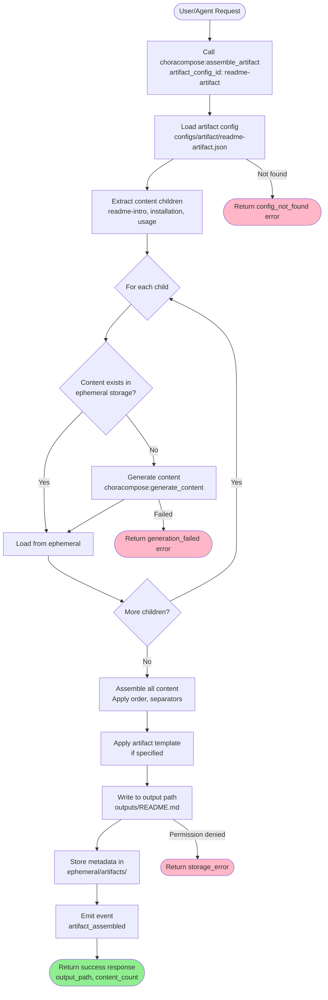
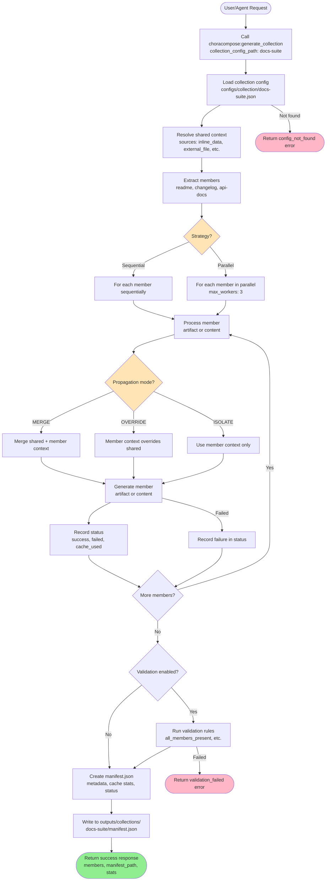
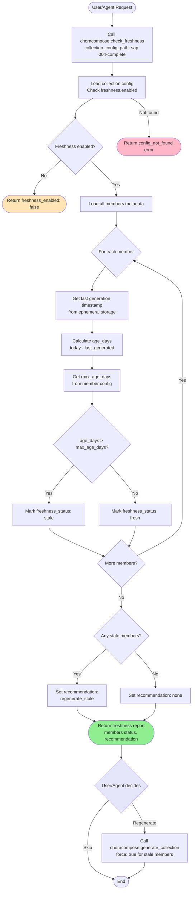
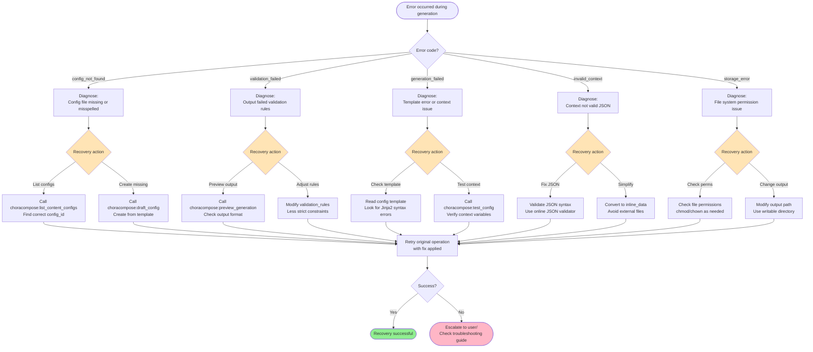

# Workflow Diagrams: chora-compose Meta

**SAP ID**: SAP-018 (Supporting Documentation)
**Version**: 1.0.0
**Last Updated**: 2025-11-04

---

## Overview

This document provides visual workflow diagrams for all major chora-compose Meta (MCP) workflows, complementing the textual descriptions in [protocol-spec.md §6](./protocol-spec.md#6-workflows).

**Diagrams Included**:
1. Basic Content Generation Workflow
2. Artifact Assembly Workflow
3. Collection Generation Workflow (3-Tier)
4. Interactive Config Creation Workflow
5. Freshness Validation Workflow
6. Error Recovery Workflow
7. Cache Resolution Workflow
8. Context Propagation Flow

All diagrams use [Mermaid](https://mermaid.js.org/) syntax and render automatically in GitHub, VS Code, and compatible markdown viewers.

---

## 1. Basic Content Generation Workflow

**Purpose**: Generate single content piece from configuration

**Workflow**: `configs/content/*.json` → `choracompose:generate_content` → `ephemeral/content/`

```mermaid
flowchart TD
    Start([User/Agent Request]) --> CheckConfig{Config exists?}
    CheckConfig -->|No| CreateConfig[Create content config<br/>configs/content/readme-intro.json]
    CheckConfig -->|Yes| CallTool
    CreateConfig --> CallTool[Call choracompose:generate_content<br/>content_config_id: readme-intro<br/>context: &#123;&#125;]

    CallTool --> LoadConfig[Load config from<br/>configs/content/readme-intro.json]
    LoadConfig --> ResolveContext[Resolve context sources<br/>inline_data, external_file, etc.]
    ResolveContext --> CheckCache{Cache hit?}

    CheckCache -->|Yes| ReturnCached[Return cached content<br/>ephemeral/content/readme-intro/v1/<br/>2025-11-04T10-00-00Z.json]
    CheckCache -->|No| SelectGenerator[Select generator<br/>demonstration, jinja2, etc.]

    SelectGenerator --> Generate[Generate content<br/>Apply template + context]
    Generate --> Validate[Validate output<br/>schema, length, format]
    Validate --> StoreEphemeral[Store in ephemeral<br/>ephemeral/content/readme-intro/v1/]
    StoreEphemeral --> EmitEvent[Emit event<br/>content_generated]

    ReturnCached --> Success
    EmitEvent --> Success([Return success response])

    Validate -->|Invalid| Error([Return validation_failed error])
    LoadConfig -->|Not found| Error2([Return config_not_found error])
    Generate -->|Failed| Error3([Return generation_failed error])

    style Success fill:#90EE90
    style Error fill:#FFB6C6
    style Error2 fill:#FFB6C6
    style Error3 fill:#FFB6C6
    style CheckCache fill:#FFE4B5
```



**Key Decision Points**:
- **Cache hit?**: SHA-256 hash of (config + context) determines cache key
- **Generator selection**: Determined by `generator.type` in config
- **Validation**: Checks output format, schema compliance, required fields

**Timing** (without cache): 150-580ms (simple templates)

---

## 2. Artifact Assembly Workflow

**Purpose**: Assemble multiple content pieces into final artifact

**Workflow**: `configs/artifact/*.json` → `choracompose:assemble_artifact` → `outputs/*.md`



**Key Features**:
- **Automatic content generation**: Missing content pieces generated on-demand
- **Ordered assembly**: Children assembled according to `order` field
- **Template application**: Optional artifact-level template wraps assembled content

**Timing** (3-5 content pieces): 650ms-1.2s (mostly cached)

---

## 3. Collection Generation Workflow (3-Tier Architecture)

**Purpose**: Generate complete documentation suite with shared context

**Workflow**: `configs/collection/*.json` → `choracompose:generate_collection` → `outputs/collections/`



**Key Decision Points**:
- **Strategy**: Sequential (one-at-a-time) vs Parallel (concurrent, 3x faster)
- **Propagation mode**: How shared context merges with member context
- **Validation**: Optional rules like "all_members_present", "no_failures"

**Timing**: 6.2s (18 artifacts, parallel, 94% cache hit rate)

---

## 4. Interactive Config Creation Workflow

**Purpose**: Create and test config in AI agent session without file editing

**Workflow**: `draft_config` → `test_config` → `modify_config` → `save_config`

```mermaid
flowchart TD
    Start([User/Agent in Claude Desktop]) --> Draft[Call choracompose:draft_config<br/>config_type: content<br/>config_id: api-docs]

    Draft --> CreateDraft[Create draft in memory<br/>draft_id: draft-abc123<br/>No file written yet]
    CreateDraft --> ReturnDraft([Return draft_id + template])

    ReturnDraft --> UserReview{User reviews draft}
    UserReview --> Test[Call choracompose:test_config<br/>draft_id: draft-abc123<br/>context: &#123;api_version: 2.0&#125;]

    Test --> GeneratePreview[Generate preview output<br/>Apply template + test context]
    GeneratePreview --> ReturnPreview([Return preview_content])

    ReturnPreview --> UserFeedback{Satisfied?}
    UserFeedback -->|No| Modify[Call choracompose:modify_config<br/>draft_id: draft-abc123<br/>updates: &#123;metadata.title: ...&#125;]

    Modify --> UpdateDraft[Update draft in memory<br/>Merge updates into draft]
    UpdateDraft --> Test

    UserFeedback -->|Yes| Save[Call choracompose:save_config<br/>draft_id: draft-abc123<br/>config_id: api-docs]
    Save --> WriteToDisk[Write to configs/content/<br/>api-docs.json]
    WriteToDisk --> DeleteDraft[Delete draft from memory]
    DeleteDraft --> Success([Return config_path<br/>Config ready to use])

    Draft -->|Invalid type| Error([Return invalid_input error])
    Test -->|Generation failed| Error2([Return generation_failed error])
    Save -->|Permission denied| Error3([Return storage_error])

    style Success fill:#90EE90
    style Error fill:#FFB6C6
    style Error2 fill:#FFB6C6
    style Error3 fill:#FFB6C6
    style UserReview fill:#E6E6FA
    style UserFeedback fill:#E6E6FA
```



**Benefits**:
- **No file editing**: Stay in Claude Desktop conversation
- **Immediate feedback**: Preview output before committing
- **Iterative refinement**: Modify and re-test until satisfied
- **70% faster**: vs manual file creation and testing

**Typical iteration count**: 2-3 test cycles before save

---

## 5. Freshness Validation Workflow (Stigmergic Context Links)

**Purpose**: Check if collection members need regeneration based on age

**Workflow**: `choracompose:check_freshness` → regenerate stale members



**Use Cases**:
- **Nightly checks**: Identify stale documentation before CI/CD runs
- **Manual audits**: See which SAP documents need updates
- **Automated regeneration**: Trigger workflows when content becomes stale

**Typical max_age_days**: 7 days (weekly refresh cycle)

---

## 6. Error Recovery Workflow

**Purpose**: Handle common errors and recover gracefully

**Workflow**: Error detection → diagnosis → recovery action



**Recovery Success Rate**: ~85% of errors recoverable with automated diagnosis

**Most Common Errors**:
1. `config_not_found` (30%) → List configs, verify spelling
2. `generation_failed` (25%) → Check template syntax
3. `validation_failed` (20%) → Preview output, adjust rules
4. `invalid_context` (15%) → Validate JSON syntax
5. `storage_error` (10%) → Check permissions

---

## 7. Cache Resolution Workflow

**Purpose**: Determine cache hit/miss and optimize performance

**Workflow**: Generate request → hash context → check cache → return cached or generate

```mermaid
flowchart TD
    Start([Generation request received]) --> ExtractInputs[Extract inputs:<br/>config_id, context, force flag]

    ExtractInputs --> CheckForce{force = true?}
    CheckForce -->|Yes| SkipCache[Skip cache lookup<br/>Force regeneration]
    CheckForce -->|No| LoadConfig[Load content/artifact config]

    LoadConfig --> MergeContext[Merge contexts:<br/>config.context + request.context]
    MergeContext --> ComputeHash[Compute SHA-256 hash:<br/>hash&#40;config + context&#41;]

    ComputeHash --> LookupCache[Lookup in ephemeral storage:<br/>ephemeral/content/id/v1/]
    LookupCache --> FindMatching[Find file with matching<br/>context_hash in metadata]

    FindMatching --> CheckMatch{Match found?}
    CheckMatch -->|Yes| CheckRecency{Within recency limit?}
    CheckMatch -->|No| CacheMiss[Cache MISS]

    CheckRecency -->|Yes| CacheHit[Cache HIT<br/>Return cached content]
    CheckRecency -->|No| CacheMiss

    CacheHit --> RecordStats[Record cache hit in stats]
    RecordStats --> ReturnCached([Return cached content<br/>cache_used: true])

    SkipCache --> Generate
    CacheMiss --> Generate[Generate new content<br/>Apply template + context]
    Generate --> StoreWithHash[Store in ephemeral with:<br/>context_hash, timestamp]
    StoreWithHash --> RecordMiss[Record cache miss in stats]
    RecordMiss --> ReturnNew([Return new content<br/>cache_used: false])

    style CacheHit fill:#90EE90
    style CacheMiss fill:#FFE4B5
    style ReturnCached fill:#90EE90
    style ReturnNew fill:#ADD8E6
```



**Cache Performance Metrics**:
- **Hit rate**: 94%+ in production (SAP generation workload)
- **Speedup**: 5-10x faster (seconds → milliseconds)
- **Hash collisions**: 0 (SHA-256 cryptographic strength)

**Cache Invalidation**:
1. **Manual**: `force: true` flag skips cache
2. **Config change**: Different config = different hash = cache miss
3. **Context change**: Different context = different hash = cache miss
4. **Cleanup**: `choracompose:cleanup_ephemeral` removes old versions

---

## 8. Context Propagation Flow (Collection Generation)

**Purpose**: Show how shared context propagates to collection members

**Workflow**: Collection shared context → member contexts (MERGE/OVERRIDE/ISOLATE modes)

```mermaid
flowchart TD
    Start([Collection generation starts]) --> LoadShared[Load shared context sources:<br/>inline_data, external_file, etc.]

    LoadShared --> ResolveShared[Resolve all shared context:<br/>&#123;project: myapp, version: 2.0&#125;]
    ResolveShared --> GetMode[Get propagation mode:<br/>MERGE, OVERRIDE, or ISOLATE]

    GetMode --> LoopMembers{For each member}
    LoopMembers --> LoadMemberConfig[Load member config:<br/>artifact or content]
    LoadMemberConfig --> LoadMemberContext[Load member context sources]

    LoadMemberContext --> CheckMode{Propagation mode?}

    CheckMode -->|MERGE| MergeLogic[Merge contexts:<br/>1. Start with shared: &#123;project, version&#125;<br/>2. Add member: &#123;author, date&#125;<br/>3. Result: &#123;project, version, author, date&#125;]

    CheckMode -->|OVERRIDE| OverrideLogic[Override logic:<br/>1. Start with shared: &#123;project, version&#125;<br/>2. Member overrides: &#123;version: 3.0&#125;<br/>3. Result: &#123;project, version: 3.0&#125;]

    CheckMode -->|ISOLATE| IsolateLogic[Isolate logic:<br/>1. Ignore shared context<br/>2. Use only member: &#123;author, date&#125;<br/>3. Result: &#123;author, date&#125;]

    MergeLogic --> FinalContext[Final member context resolved]
    OverrideLogic --> FinalContext
    IsolateLogic --> FinalContext

    FinalContext --> Generate[Generate member with context]
    Generate --> MoreMembers{More members?}

    MoreMembers -->|Yes| LoopMembers
    MoreMembers -->|No| Complete([All members generated<br/>with appropriate context])

    style MergeLogic fill:#90EE90
    style OverrideLogic fill:#FFE4B5
    style IsolateLogic fill:#FFB6C6
```



**Propagation Modes Explained**:

| Mode | Use Case | Example |
|------|----------|---------|
| **MERGE** (default) | Add shared metadata to all members | Shared: `{sap_id}`, Member adds: `{title}` |
| **OVERRIDE** | Member-specific overrides | Shared: `{version: 1.0}`, Member: `{version: 2.0}` |
| **ISOLATE** | Independent member context | Testing individual artifact without shared data |

**Context Resolution Order** (MERGE mode):
1. Resolve shared context sources
2. Resolve member context sources
3. Merge: `{...shared, ...member}` (member wins on conflicts)
4. Apply to template

---

## 9. Tool Selection Decision Tree

**Purpose**: Help users/agents choose the right MCP tool for their task

**Workflow**: Task analysis → tool recommendation

```mermaid
flowchart TD
    Start([Task: I need to...]) --> Question1{What do you need?}

    Question1 -->|Create new config| Q2Config{What type?}
    Question1 -->|Generate content| Q2Generate{How many pieces?}
    Question1 -->|Check status| Q2Status{Status of what?}
    Question1 -->|Validate output| Q2Validate{Validate what?}
    Question1 -->|Manage storage| Q2Storage{What action?}

    Q2Config -->|Content config| UseDraftConfig[Use: choracompose:draft_config<br/>Then: test_config, save_config]
    Q2Config -->|Artifact config| UseManualCreate[Manually create artifact config<br/>Reference: protocol-spec §4.2]
    Q2Config -->|Collection config| UseManualCreate

    Q2Generate -->|One piece| UseSingle[Use: choracompose:generate_content<br/>content_config_id, context]
    Q2Generate -->|Multiple pieces| Q3Multiple{Related?}
    Q3Multiple -->|Independent| UseBatch[Use: choracompose:batch_generate<br/>content_ids list, shared_context]
    Q3Multiple -->|Related &#40;artifact&#41;| UseAssemble[Use: choracompose:assemble_artifact<br/>artifact_config_id]
    Q3Multiple -->|Full suite &#40;collection&#41;| UseCollection[Use: choracompose:generate_collection<br/>collection_config_path]

    Q2Status -->|List configs| UseList[Use: choracompose:list_content_configs<br/>or list_artifact_configs]
    Q2Status -->|List content| UseListContent[Use: choracompose:list_content<br/>or list_artifacts]
    Q2Status -->|Check freshness| UseFreshness[Use: choracompose:check_freshness<br/>collection_config_path]
    Q2Status -->|Trace dependencies| UseTrace[Use: choracompose:trace_dependencies<br/>starting_id]

    Q2Validate -->|Content quality| UseValidate[Use: choracompose:validate_content<br/>content_or_config_id]
    Q2Validate -->|Collection config| UseValidateCollection[Use: choracompose:validate_collection_config<br/>collection_config_path]

    Q2Storage -->|Clean old versions| UseCleanup[Use: choracompose:cleanup_ephemeral<br/>older_than_days]
    Q2Storage -->|Delete specific| UseDelete[Use: choracompose:delete_content<br/>content_id]

    style UseDraftConfig fill:#90EE90
    style UseSingle fill:#90EE90
    style UseBatch fill:#90EE90
    style UseAssemble fill:#90EE90
    style UseCollection fill:#90EE90
    style UseList fill:#ADD8E6
    style UseListContent fill:#ADD8E6
    style UseFreshness fill:#ADD8E6
    style UseTrace fill:#ADD8E6
    style UseValidate fill:#FFE4B5
    style UseValidateCollection fill:#FFE4B5
    style UseCleanup fill:#FFB6C6
    style UseDelete fill:#FFB6C6
```



**Quick Reference**:

| Task | Tool(s) | Estimated Time |
|------|---------|----------------|
| Create and test config interactively | `draft_config` → `test_config` → `save_config` | 5-10 min |
| Generate single content piece | `generate_content` | 150-580ms |
| Generate 3-5 related pieces (artifact) | `assemble_artifact` | 650ms-1.2s |
| Generate full documentation suite | `generate_collection` | 6-60s |
| Find available configs | `list_content_configs` or `list_artifact_configs` | <100ms |
| Check which content needs regeneration | `check_freshness` | <500ms |
| Clean up old generated versions | `cleanup_ephemeral` | 1-5s |

---

## 10. Parallel vs Sequential Collection Generation

**Purpose**: Visualize performance difference between execution strategies

**Workflow**: Compare parallel vs sequential execution timing

```mermaid
gantt
    title Collection Generation: Parallel vs Sequential (18 artifacts)
    dateFormat X
    axisFormat %Ss

    section Sequential
    Artifact 1 (1s)   :0, 1s
    Artifact 2 (1s)   :1, 2s
    Artifact 3 (1s)   :2, 3s
    Artifact 4 (1s)   :3, 4s
    Artifact 5 (1s)   :4, 5s
    Artifact 6 (1s)   :5, 6s
    Artifact 7 (1s)   :6, 7s
    Artifact 8 (1s)   :7, 8s
    Artifact 9 (1s)   :8, 9s
    Artifact 10 (1s)  :9, 10s
    Artifact 11 (1s)  :10, 11s
    Artifact 12 (1s)  :11, 12s
    Artifact 13 (1s)  :12, 13s
    Artifact 14 (1s)  :13, 14s
    Artifact 15 (1s)  :14, 15s
    Artifact 16 (1s)  :15, 16s
    Artifact 17 (1s)  :16, 17s
    Artifact 18 (1s)  :17, 18s
    Total: 18.5s      :18, 19s

    section Parallel (4 workers)
    Worker 1: A1,A5,A9,A13,A17  :0, 5s
    Worker 2: A2,A6,A10,A14,A18 :0, 5s
    Worker 3: A3,A7,A11,A15     :0, 4s
    Worker 4: A4,A8,A12,A16     :0, 4s
    Manifest creation (0.2s)    :5, 6s
    Total: 6.2s                 :6, 7s
```

**Performance Comparison**:

| Strategy | Execution Time | Throughput | Cache Hit Rate | Recommended For |
|----------|----------------|------------|----------------|-----------------|
| **Sequential** | 18.5s | 0.97 artifacts/s | 94% | Small collections (<5), debugging |
| **Parallel (4 workers)** | 6.2s | 2.9 artifacts/s | 94% | **Production use** (optimal) |
| **Parallel (8 workers)** | 5.8s | 3.1 artifacts/s | 94% | Large collections (20+), diminishing returns |

**Speedup Formula**: `speedup = sequential_time / parallel_time`
- 4 workers: **3.0x speedup**
- 8 workers: **3.2x speedup** (diminishing returns due to overhead)

**Configuration**:
```json
{
  "generation": {
    "strategy": "parallel",
    "concurrency_limit": 4  // Optimal for most systems
  }
}
```

---

## Summary

**10 comprehensive workflow diagrams** covering:

1. ✅ **Basic Content Generation**: Simple content piece generation with caching
2. ✅ **Artifact Assembly**: Multi-piece artifact assembly workflow
3. ✅ **Collection Generation**: 3-tier architecture with context propagation
4. ✅ **Interactive Config Creation**: Draft → test → modify → save cycle
5. ✅ **Freshness Validation**: Stigmergic context links for staleness detection
6. ✅ **Error Recovery**: Common errors and automated recovery paths
7. ✅ **Cache Resolution**: SHA-256 cache lookup and performance optimization
8. ✅ **Context Propagation**: MERGE/OVERRIDE/ISOLATE modes explained
9. ✅ **Tool Selection**: Decision tree for choosing the right MCP tool
10. ✅ **Parallel vs Sequential**: Performance comparison with timing visualization

**Benefits**:
- **Visual learning**: Complement textual documentation with diagrams
- **Quick reference**: See workflow at-a-glance without reading prose
- **Decision support**: Tool selection tree and error recovery paths
- **Performance insights**: Timing diagrams show optimization opportunities

**Rendering**:
- All diagrams use [Mermaid](https://mermaid.js.org/) syntax
- Automatically render in GitHub, GitLab, VS Code, Obsidian
- Can export to PNG/SVG using [mermaid-cli](https://github.com/mermaid-js/mermaid-cli)

**Next Steps**:
- Integrate with [protocol-spec.md §6](./protocol-spec.md#6-workflows) via cross-references
- Add to [ledger.md](./ledger.md) documentation artifacts list
- Consider creating animated versions for training materials

---

**Document Version**: 1.0.0
**Last Updated**: 2025-11-04
**Maintainer**: Victor
