# SAP-005: CI/CD Workflows

**Version:** 1.0.0 | **Status:** Active | **Maturity:** Production

> GitHub Actions automation for testing, security, and deployment—catch issues before merge with matrix testing, caching, and <5 min feedback loops.

---

## 🚀 Quick Start (2 minutes)

```bash
# Check CI status for current branch
just ci-status

# View logs for a specific workflow run
just ci-logs 12345678

# List all available workflows
just ci-workflows

# Trigger a workflow manually
just ci-trigger test.yml
```

**First time?** → Read [adoption-blueprint.md](adoption-blueprint.md) for GitHub Actions setup (5-min read)

---

## 📖 What Is SAP-005?

SAP-005 provides **GitHub Actions automation** with 10 pre-configured workflows for testing, security scanning, linting, documentation validation, and deployment. It defines workflow structure, triggers, caching strategies, and integration patterns—ensuring code quality before merge with fast feedback (<5 min execution time) and matrix testing across Python 3.11-3.13.

**Key Innovation**: Parallel execution with intelligent caching (pip dependencies), matrix testing for cross-version compatibility, and security-first design (CodeQL + dependency review always enabled).

---

## 🎯 When to Use

Use SAP-005 when you need to:

1. **Automate quality gates** - Run tests, linting, type checking on every push/PR
2. **Matrix testing** - Test across Python 3.11, 3.12, 3.13 for compatibility
3. **Security scanning** - CodeQL static analysis + dependency vulnerability checks
4. **Fast feedback** - Get results in <5 min with cached dependencies
5. **Deployment automation** - Publish to PyPI, deploy to production with GitHub Actions

**Not needed for**: Manual testing only, single-version projects (but multi-version recommended), or projects without GitHub

---

## ✨ Key Features

- ✅ **10 Workflows** - test, lint, smoke, docs-quality, codeql, dependency-review, release, publish, docker, pre-commit
- ✅ **Matrix Testing** - Python 3.11, 3.12, 3.13 for cross-version compatibility
- ✅ **Fast Feedback** - <5 min execution time with intelligent caching (pip dependencies)
- ✅ **Security First** - CodeQL + dependency review always enabled (required for merge)
- ✅ **Parallel Execution** - Independent workflows run simultaneously
- ✅ **6 CLI Commands** - ci-status, ci-logs, ci-retry, ci-workflows, ci-workflow-show, ci-trigger
- ✅ **Coverage Comments** - Automatic PR comments with coverage reports
- ✅ **Release Automation** - Automated PyPI publishing with semantic versioning

---

## 📚 Quick Reference

### 10 GitHub Actions Workflows

#### Core Workflows (Required for Merge)

**1. test.yml** - Test Matrix
- **Trigger**: push (main, develop), pull_request
- **Purpose**: Run pytest across Python versions, enforce coverage ≥85%
- **Matrix**: Python 3.11, 3.12, 3.13
- **Duration**: ~2-3 minutes
- **Required**: ✅ Must pass for merge

**2. lint.yml** - Code Quality
- **Trigger**: push (main, develop), pull_request
- **Purpose**: Run ruff (linting) and mypy (type checking)
- **Duration**: ~1-2 minutes
- **Required**: ✅ Must pass for merge

**3. smoke.yml** - Smoke Tests
- **Trigger**: push (main, develop), pull_request
- **Purpose**: Quick validation (server starts, basic operations)
- **Duration**: ~30-60 seconds
- **Required**: ✅ Must pass for merge

#### Documentation Workflow (Recommended)

**4. docs-quality.yml** - Documentation Validation
- **Trigger**: push, pull_request, paths: ['**/*.md', 'docs/**']
- **Purpose**: Validate markdown, check links, verify structure
- **Duration**: ~1-2 minutes
- **Required**: ⚠️ Recommended (not blocking)

#### Security Workflows (Required)

**5. codeql.yml** - CodeQL Security Scanning
- **Trigger**: push, pull_request, schedule (weekly)
- **Purpose**: Static security analysis, vulnerability detection
- **Duration**: ~3-5 minutes
- **Required**: ✅ Must pass for merge

**6. dependency-review.yml** - Dependency Security
- **Trigger**: pull_request
- **Purpose**: Check for vulnerable dependencies
- **Duration**: ~1-2 minutes
- **Required**: ✅ Must pass for merge

#### Release & Deployment Workflows (Manual)

**7. release.yml** - Release Preparation
- **Trigger**: workflow_dispatch (manual)
- **Purpose**: Bump version, update CHANGELOG, create git tag
- **Duration**: ~1-2 minutes
- **Required**: Manual trigger

**8. publish.yml** - PyPI Publishing
- **Trigger**: release (published)
- **Purpose**: Build distribution packages, publish to PyPI
- **Duration**: ~2-3 minutes
- **Required**: Triggered by release event

**9. docker.yml** - Docker Build & Push
- **Trigger**: push (main), release (published)
- **Purpose**: Build multi-stage Docker image, push to registry
- **Duration**: ~5-10 minutes
- **Required**: Optional (if using Docker)

**10. pre-commit.yml** - Pre-commit Autoupdate
- **Trigger**: schedule (weekly), workflow_dispatch
- **Purpose**: Update pre-commit hook versions
- **Duration**: ~1-2 minutes
- **Required**: Automated maintenance

---

### 6 CLI Commands

#### 1. **ci-status** - Check CI Status
```bash
just ci-status
# Shows: Recent workflow runs (status, name, conclusion, URL)
# Use: Session startup, monitoring current branch
```

#### 2. **ci-logs RUN_ID** - View Workflow Logs
```bash
just ci-logs 12345678
# Shows: Complete workflow logs for specific run
# Use: Debugging CI failures
```

#### 3. **ci-retry RUN_ID** - Retry Failed Workflow
```bash
just ci-retry 12345678
# Action: Re-run failed jobs in workflow
# Use: Transient CI failures (network issues, rate limits)
```

#### 4. **ci-workflows** - List All Workflows
```bash
just ci-workflows
# Shows: Available workflows with descriptions
# Use: Discovery, understanding CI setup
```

#### 5. **ci-workflow-show WORKFLOW** - Show Workflow Details
```bash
just ci-workflow-show test.yml
# Shows: Workflow configuration, triggers, jobs
# Use: Understanding workflow behavior
```

#### 6. **ci-trigger WORKFLOW** - Trigger Workflow Manually
```bash
just ci-trigger test.yml
# Action: Start workflow_dispatch workflows manually
# Use: Release, publish, manual testing
```

---

## 🔗 Integration with Other SAPs

| SAP | Integration | How It Works |
|-----|-------------|--------------|
| **SAP-004** (Testing) | Automated Testing | test.yml runs `pytest --cov=src --cov-fail-under=85` |
| **SAP-006** (Quality Gates) | Pre-commit Validation | pre-commit.yml auto-updates hook versions weekly |
| **SAP-011** (Docker) | Container Build | docker.yml builds multi-stage Dockerfile on release |
| **SAP-003** (Bootstrap) | Included by Default | Generated projects include .github/workflows/ with 10 workflows |
| **SAP-016** (Link Validation) | Docs Quality | docs-quality.yml runs link validation on markdown changes |

**Cross-SAP Workflow Example**:
```bash
# Local Development (SAP-004 + SAP-006)
just test                      # Run tests locally
git add .
git commit -m "Add feature"    # Pre-commit runs smoke tests

# Push to GitHub (SAP-005)
git push origin feature-branch

# CI/CD Pipeline Executes:
# 1. smoke.yml (30-60s)
# 2. test.yml (2-3 min, Python 3.11/3.12/3.13)
# 3. lint.yml (1-2 min, ruff + mypy)
# 4. codeql.yml (3-5 min, security scan)
# 5. dependency-review.yml (1-2 min, vuln check)
# Total: ~5 min parallel execution

# PR Merge → Release (SAP-005)
just ci-trigger release.yml    # Bump version, tag
# Triggers publish.yml → PyPI
# Triggers docker.yml → Container registry
```

---

## 🏆 Success Metrics

- **Execution Time**: <5 min for core workflows (smoke + test + lint + security)
- **Coverage**: 85%+ enforced via test.yml
- **Security**: 100% scans (CodeQL + dependency review on every PR)
- **Matrix Testing**: 3 Python versions (3.11, 3.12, 3.13)
- **Cache Hit Rate**: 80-90% for pip dependencies (2-3x faster execution)
- **Failure Detection**: 95%+ issues caught before merge

---

## 🎓 Workflow Execution Flow

```mermaid
graph TD
    A[Push to GitHub] --> B{Trigger Workflows}
    B -->|Parallel| C[smoke.yml 30-60s]
    B -->|Parallel| D[test.yml 2-3min]
    B -->|Parallel| E[lint.yml 1-2min]
    B -->|Parallel| F[codeql.yml 3-5min]
    B -->|Parallel| G[dependency-review.yml 1-2min]
    C --> H{All Pass?}
    D --> H
    E --> H
    F --> H
    G --> H
    H -->|Yes| I[✅ Ready to Merge]
    H -->|No| J[❌ Fix Failures]
    I --> K[Merge to main]
    K --> L[Trigger Release]
    L --> M[publish.yml → PyPI]
    L --> N[docker.yml → Registry]
```



---

## 🔧 Troubleshooting

**Problem**: CI workflow fails with "Cache restore failed"

**Solution**: Pip cache corruption, retry workflow:
```bash
just ci-retry 12345678
# Cache will be regenerated on next run
```

---

**Problem**: Matrix test fails only on Python 3.13

**Solution**: Version-specific compatibility issue:
```bash
# Reproduce locally with pyenv
pyenv install 3.13.0
pyenv local 3.13.0
pytest tests/

# Fix compatibility issues (async, typing, etc.)
# Update pyproject.toml if needed:
# requires-python = ">=3.11,<3.14"
```

---

**Problem**: CodeQL scan fails with security vulnerability

**Solution**: Review and fix security issue:
```bash
# View CodeQL results
gh api repos/owner/repo/code-scanning/alerts

# Fix vulnerability in code
# Push fix → CodeQL re-runs → Verify pass
```

---

**Problem**: Workflow stuck in "Queued" status

**Solution**: GitHub Actions runner availability issue:
```bash
# Check workflow status
just ci-status

# Cancel and retry if stuck >10 min
gh run cancel 12345678
just ci-retry 12345678
```

---

## 📄 Learn More

- **[protocol-spec.md](protocol-spec.md)** - Complete workflow specifications (13KB)
- **[AGENTS.md](AGENTS.md)** - AI agent CI/CD workflows (22KB, 11-min read)
- **[CLAUDE.md](CLAUDE.md)** - Claude-specific CI/CD patterns (18KB, 9-min read)
- **[adoption-blueprint.md](adoption-blueprint.md)** - GitHub Actions setup guide (5KB, 5-min read)
- **[capability-charter.md](capability-charter.md)** - Problem statement and solution design (7KB)
- **[ledger.md](ledger.md)** - Production adoption metrics (14KB)

---

## 📞 Support

- **Documentation**: Read [protocol-spec.md](protocol-spec.md) for complete workflow reference
- **Issues**: Report bugs via GitHub issues with `[SAP-005]` prefix
- **Feedback**: Log adoption feedback in [ledger.md](ledger.md)
- **GitHub Actions**: See GitHub Actions docs (docs.github.com/actions) for advanced configuration

---

**Version History**:
- **1.0.0** (2025-10-28) - Initial CI/CD workflows with 10 workflows, matrix testing, <5 min feedback

---

*Part of the [Skilled Awareness Package (SAP) Framework](../sap-framework/) - See [INDEX.md](../INDEX.md) for all 32+ capabilities*
