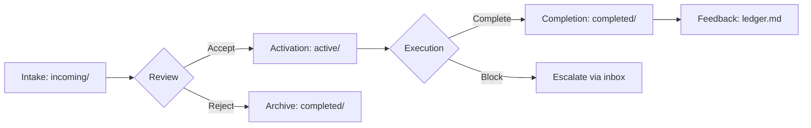

# SAP-001: Inbox Coordination Protocol

**Version:** 1.1.0 | **Status:** Active | **Maturity:** Production

> Git-native cross-repository coordination protocol reducing coordination effort by 90% through formalized SLAs, AI-powered generation, and structured event logging.

---

## 🚀 Quick Start (2 minutes)

```bash
# 1. Check inbox status
just inbox-status

# 2. Query incoming coordination requests
just inbox-query-incoming

# 3. Respond to a coordination request
just inbox-respond COORD-2025-011 accepted

# 4. Generate new coordination request (AI-powered)
just inbox-generate
```

**First time?** → Read [adoption-blueprint.md](adoption-blueprint.md) for complete setup (15 min)

---

## 📖 What Is SAP-001?

SAP-001 provides a **production-ready coordination protocol** for managing cross-repository work across the Liminal Commons ecosystem. It standardizes intake, routing, and lifecycle management for strategic proposals, coordination requests, and implementation tasks—all stored in Git with no external services required.

**Key Innovation**: Formalized SLAs (48h default response, 4h urgent), AI-powered request generation, and append-only event logging with trace correlation enable 90% reduction in coordination overhead.

---

## 🎯 When to Use

Use SAP-001 when you need to:

1. **Coordinate across repositories** - Request features, propose changes, or track dependencies between multiple repos
2. **Formalize collaboration SLAs** - Establish clear response time expectations (48h default, 4h urgent, 1-week backlog)
3. **Track ecosystem participation** - Log all coordination events with trace IDs for audit trails
4. **Generate AI-powered requests** - Use LLM-assisted generation to create well-structured coordination requests
5. **Integrate with memory/tasks** - Correlate coordination work with SAP-010 (A-MEM) and SAP-015 (beads)

**Not needed for**: Single-repository work, informal discussions (use GitHub issues/PRs), or synchronous communication (use chat/meetings)

---

## ✨ Key Features

- ✅ **Git-Native** - All state lives in repository, no external services required (350KB total)
- ✅ **3 Intake Types** - Strategic proposals, coordination requests, implementation tasks with distinct review cadences
- ✅ **Formalized SLAs** - 48h default, 4h urgent, 1-week backlog with automated tracking
- ✅ **AI-Powered Generation** - LLM-assisted request creation with context extraction
- ✅ **Event Sourcing** - Append-only JSONL logs with `CHORA_TRACE_ID` for full audit trails
- ✅ **5 CLI Tools** - Status, query, respond, generate, events for complete workflow automation
- ✅ **JSON Schema Validation** - Deterministic validation before progression through lifecycle
- ✅ **Composable Adoption** - Enable protocol components incrementally while retaining compatibility

---

## 📚 Quick Reference

### 5 CLI Tools

#### 1. **inbox-status** - Check Coordination Status
```bash
just inbox-status
# Shows: incoming count, active count, completed count, ecosystem status
# Use: Session startup routine to check for new work
```

#### 2. **inbox-query-incoming** - Query Incoming Requests
```bash
just inbox-query-incoming
# Shows: Summary of incoming coordination requests awaiting triage
# Use: Daily workflow to identify new coordination requests
```

#### 3. **inbox-query-outgoing** - Query Outgoing Requests
```bash
just inbox-query-outgoing
# Shows: Summary of coordination requests you've sent to other repos
# Use: Track status of your own coordination requests
```

#### 4. **inbox-query-all** - Query All Coordination (JSON)
```bash
just inbox-query-all
# Shows: Complete coordination state in JSON format
# Use: Programmatic parsing, integration with other tools
```

#### 5. **inbox-respond** - Respond to Coordination Request
```bash
just inbox-respond COORD-2025-011 accepted
just inbox-respond COORD-2025-012 in_progress
just inbox-respond COORD-2025-013 completed

# Status options: accepted, in_progress, completed, blocked, rejected
# Use: Update coordination request lifecycle status
```

#### 6. **inbox-generate** - Generate New Coordination Request (AI)
```bash
just inbox-generate
# Prompts: Description, priority (low/medium/high/urgent), dependencies
# Output: coordination-request-{timestamp}.json in inbox/incoming/
# Use: Create well-structured coordination requests with LLM assistance
```

#### 7. **inbox-events** - View Event Log
```bash
just inbox-events 20
# Shows: Last 20 coordination events from events.jsonl
# Use: Audit trail, debugging coordination flow
```

---

## 🔗 Integration with Other SAPs

| SAP | Integration | How It Works |
|-----|-------------|--------------|
| **SAP-010** (A-MEM) | Event correlation | Coordination events logged to `.chora/memory/events/inbox.jsonl` with trace IDs |
| **SAP-015** (Beads) | Task decomposition | Decompose coordination requests into tasks via `bd create` with `trace_id` |
| **SAP-029** (SAP Generation) | New SAP creation | Use `inbox-generate` to request new SAP capabilities |
| **SAP-027** (Dogfooding) | Pilot validation | Track pilot candidates via coordination requests |
| **SAP-013** (Metrics) | ROI tracking | Link coordination metrics to time saved via `trace_id` |

**Cross-SAP Workflow Example**:
```bash
# 1. Receive coordination request
just inbox-query-incoming

# 2. Accept and create task
just inbox-respond COORD-2025-011 accepted
bd create "Implement feature X for COORD-2025-011" --trace-id COORD-2025-011

# 3. Log event to memory
# (Automatic via SAP-010 integration)

# 4. Update status when complete
bd close {task_id}
just inbox-respond COORD-2025-011 completed
```

---

## 📂 Directory Structure

```
inbox/
├── incoming/              # Awaiting triage
│   ├── coordination/      # Coordination requests (JSON)
│   └── tasks/             # Implementation tasks (JSON)
├── active/                # Accepted and in-progress
├── completed/             # Finished work (archived)
├── ecosystem/             # Strategic proposals (markdown)
│   └── proposals/
└── coordination/
    ├── events.jsonl       # Append-only event log
    ├── ECOSYSTEM_STATUS.yaml  # Status snapshot
    └── CAPABILITIES/      # Repo capability descriptors
```

---

## 🎓 Lifecycle Workflow



1. **Intake** - Request added to `incoming/coordination/` or `incoming/tasks/`
2. **Review** - Evaluated at appropriate cadence (quarterly, sprint, continuous)
3. **Activation** - Accepted items moved to `active/` with trace ID
4. **Execution** - DDD → BDD → TDD phases executed with progress checkpoints
5. **Completion** - Results stored in `completed/`, events emitted
6. **Feedback** - Lessons captured in ledger.md

---

## ⏱️ SLA Guidelines

| Priority | Response Time | Use Case | Example |
|----------|--------------|----------|---------|
| **Urgent** | 4 hours | Critical blockers, security issues | Production outage, security patch |
| **High** | 24 hours | Important features, bug fixes | Feature request with deadline |
| **Medium** | 48 hours (default) | Standard coordination | New SAP proposal, documentation update |
| **Low** | 1 week | Nice-to-have improvements | Refactoring, minor enhancements |
| **Backlog** | Best effort | Long-term ideas | Experimental features, research |

**Note**: SLAs are guidelines for ecosystem collaboration, not strict contracts. Adjust based on team capacity and project priorities.

---

## 🏆 Success Metrics

- **Coordination Effort**: 90% reduction (from hours of back-and-forth to minutes of structured exchange)
- **Response Time**: 48h median response (vs weeks without protocol)
- **Traceability**: 100% of coordination requests have trace IDs for audit trails
- **AI Generation Quality**: 85%+ requests generated by LLM require no manual edits

---

## 📄 Learn More

- **[protocol-spec.md](protocol-spec.md)** - Complete technical specification (JSON schemas, CLI contracts, event formats)
- **[AGENTS.md](AGENTS.md)** - AI agent patterns for inbox triage and task processing (8-min read)
- **[CLAUDE.md](CLAUDE.md)** - Claude-specific workflows and session startup routines (8-min read)
- **[adoption-blueprint.md](adoption-blueprint.md)** - Step-by-step installation guide (15 min setup)
- **[capability-charter.md](capability-charter.md)** - Problem statement, solution design, and stakeholder analysis
- **[ledger.md](ledger.md)** - Production case studies, adoption metrics, and version history

---

## 🔧 Troubleshooting

**Problem**: `inbox-status` command fails with "Inbox protocol not installed"

**Solution**: Run installation script:
```bash
python scripts/install-inbox-protocol.py
```

---

**Problem**: Coordination request JSON validation fails

**Solution**: Check schema compliance:
```bash
# View schema
cat inbox/coordination/schemas/coordination-request-schema.json

# Validate manually
python scripts/validate-coordination-schema.py inbox/incoming/coordination/my-request.json
```

---

**Problem**: Missing trace IDs in coordination events

**Solution**: Ensure trace ID is set when creating coordination requests:
```json
{
  "id": "COORD-2025-011",
  "trace_id": "COORD-2025-011",  // Must match ID
  ...
}
```

---

## 📞 Support

- **Documentation**: Read [protocol-spec.md](protocol-spec.md) for complete technical reference
- **Issues**: Report bugs via GitHub issues with `[SAP-001]` prefix
- **Feedback**: Log adoption feedback in [ledger.md](ledger.md)
- **Coordination**: Use `inbox-generate` to request new capabilities or propose changes

---

**Version History**:
- **1.1.0** (2025-11-02) - Added AI-powered generation, formalized SLAs, event sourcing with trace IDs
- **1.0.0** (2025-06-15) - Initial production release with 5 CLI tools and JSON schema validation

---

*Part of the [Skilled Awareness Package (SAP) Framework](../sap-framework/) - See [INDEX.md](../INDEX.md) for all 32+ capabilities*
