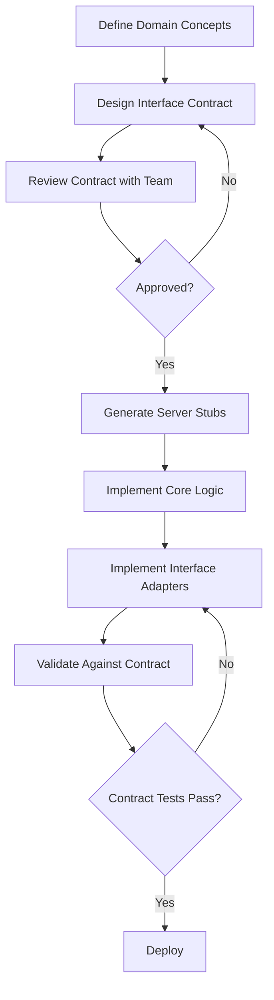

# SAP-042: Interface Design Patterns - Protocol Specification

**SAP ID**: SAP-042
**Name**: Interface Design Patterns
**Version**: 1.0.0
**Last Updated**: 2025-11-12

---

## Table of Contents

1. [Overview](#overview)
2. [Domain-Driven Design Principles](#domain-driven-design-principles)
3. [Contract-First Design](#contract-first-design)
4. [Interface Types](#interface-types)
5. [Error Handling Standards](#error-handling-standards)
6. [Versioning Strategies](#versioning-strategies)
7. [Observability Patterns](#observability-patterns)
8. [Core-Interface Separation](#core-interface-separation)
9. [Testing Strategies](#testing-strategies)
10. [Prescriptive Guidelines](#prescriptive-guidelines)

---

## Overview

This protocol specification defines **concrete patterns and technical standards** for designing interfaces for capability servers. It provides code examples, workflows, and decision matrices to implement the principles outlined in the [capability-charter.md](./capability-charter.md).

**Target Audience**: Developers implementing capability servers (Orchestrator, Manifest, Gateway, etc.)

**Scope**: Interface design for REST APIs, CLI tools, gRPC services, and MCP (Model Context Protocol) integrations

---

## Domain-Driven Design Principles

### Bounded Context Definition

Each capability server represents a **bounded context** with clear boundaries:

**Example: Orchestrator Capability**
- **Domain**: Lifecycle management of deployments and environments
- **Concepts**: Environment, Deployment, ServiceInstance, Provision, Scale, Rollback
- **Boundaries**: Does NOT handle service discovery (that's Manifest's domain), does NOT handle routing (that's Gateway's domain)

**Ubiquitous Language**:
```
Good:
- REST: POST /environments/{envId}/deployments
- CLI: chora-orch deployment create --env prod
- Logs: "Creating deployment dep-123 in environment prod"

Bad (inconsistent terminology):
- REST: POST /envs/{id}/services
- CLI: chora-orch add-service --environment prod
- Logs: "Starting new service instance in env prod"
```

### Aggregate Modeling

Model aggregates properly to reflect domain relationships:

**Environment Aggregate** (root):
```python
class Environment:
    id: str
    name: str
    deployments: List[Deployment]  # Aggregate contains deployments

    def add_deployment(self, deployment: Deployment):
        # Business logic: validate deployment fits environment
        if self.resource_quota_exceeded(deployment):
            raise QuotaExceededError(f"Environment {self.name} quota exceeded")
        self.deployments.append(deployment)
```

**REST API Reflects Aggregates**:
```
POST /environments/{envId}/deployments  # Deployment is sub-resource
GET  /environments/{envId}/deployments/{depId}
```

**CLI Reflects Aggregates**:
```bash
chora-orch deployment create --env prod --config config.json
chora-orch deployment list --env prod
```

### No Leaking Implementation Details

**Bad Example** (leaks Docker):
```json
POST /deployments
{
  "docker_image": "nginx:latest",
  "docker_network": "bridge",
  "docker_restart_policy": "unless-stopped"
}
```

**Good Example** (abstracts container runtime):
```json
POST /environments/prod/deployments
{
  "container_image": "nginx:latest",
  "network_mode": "default",
  "restart_policy": "always"
}
```

If orchestrator switches from Docker to Kubernetes, the good API doesn't change—only internal implementation does.

---

## Contract-First Design

### Workflow: Contract-First Development



### OpenAPI Contract Example

**File**: `openapi.yaml`

```yaml
openapi: 3.0.0
info:
  title: Orchestrator API
  version: 1.0.0
  description: Capability server for managing deployments and environments

servers:
  - url: https://orchestrator.chora.local/api/v1
    description: Production

paths:
  /environments/{envId}/deployments:
    post:
      summary: Create deployment
      operationId: createDeployment
      tags:
        - Deployments
      parameters:
        - name: envId
          in: path
          required: true
          description: Environment ID
          schema:
            type: string
            pattern: '^[a-z0-9-]+$'
        - name: X-Request-ID
          in: header
          required: false
          description: Correlation ID for distributed tracing
          schema:
            type: string
            format: uuid
      requestBody:
        required: true
        content:
          application/json:
            schema:
              $ref: '#/components/schemas/DeploymentConfig'
            examples:
              simple:
                value:
                  service: "webapp"
                  replicas: 3
                  image: "nginx:latest"
      responses:
        '201':
          description: Deployment created successfully
          headers:
            X-Request-ID:
              schema:
                type: string
                format: uuid
              description: Correlation ID
          content:
            application/json:
              schema:
                $ref: '#/components/schemas/Deployment'
        '400':
          description: Invalid deployment configuration
          content:
            application/json:
              schema:
                $ref: '#/components/schemas/Error'
              examples:
                invalidReplicas:
                  value:
                    error:
                      code: "INVALID_DEPLOYMENT_CONFIG"
                      message: "replicas must be >= 1"
                      field: "replicas"
        '404':
          description: Environment not found
          content:
            application/json:
              schema:
                $ref: '#/components/schemas/Error'
        '500':
          description: Internal server error
          content:
            application/json:
              schema:
                $ref: '#/components/schemas/Error'

components:
  schemas:
    DeploymentConfig:
      type: object
      required:
        - service
        - replicas
        - image
      properties:
        service:
          type: string
          description: Service name
          pattern: '^[a-z0-9-]+$'
        replicas:
          type: integer
          description: Number of replicas
          minimum: 1
          maximum: 100
        image:
          type: string
          description: Container image
          example: "nginx:1.21"
        environment:
          type: object
          description: Environment variables
          additionalProperties:
            type: string

    Deployment:
      type: object
      properties:
        id:
          type: string
          description: Deployment ID
          example: "dep-a3f8e9"
        environment_id:
          type: string
          description: Parent environment ID
          example: "prod"
        service:
          type: string
          description: Service name
          example: "webapp"
        replicas:
          type: integer
          description: Current replica count
          example: 3
        status:
          type: string
          enum: [creating, running, scaling, failed]
          description: Deployment status
        created_at:
          type: string
          format: date-time
          description: Creation timestamp

    Error:
      type: object
      required:
        - error
      properties:
        error:
          type: object
          required:
            - code
            - message
          properties:
            code:
              type: string
              description: Machine-readable error code
              example: "INVALID_DEPLOYMENT_CONFIG"
            message:
              type: string
              description: Human-readable error message
              example: "replicas must be >= 1"
            field:
              type: string
              description: Field that caused the error (if applicable)
              example: "replicas"
            details:
              type: object
              description: Additional error context
              additionalProperties: true
```

### gRPC Contract Example

**File**: `orchestrator.proto`

```protobuf
syntax = "proto3";

package chora.orchestrator.v1;

service OrchestratorService {
  // Create a new deployment in an environment
  rpc CreateDeployment(CreateDeploymentRequest) returns (Deployment);

  // Get deployment by ID
  rpc GetDeployment(GetDeploymentRequest) returns (Deployment);

  // List deployments in an environment
  rpc ListDeployments(ListDeploymentsRequest) returns (ListDeploymentsResponse);

  // Delete a deployment
  rpc DeleteDeployment(DeleteDeploymentRequest) returns (google.protobuf.Empty);
}

message CreateDeploymentRequest {
  // Environment ID (required)
  string env_id = 1;

  // Deployment configuration
  DeploymentConfig config = 2;
}

message DeploymentConfig {
  // Service name (required)
  string service = 1;

  // Number of replicas (required, must be >= 1)
  int32 replicas = 2;

  // Container image (required)
  string image = 3;

  // Environment variables (optional)
  map<string, string> environment = 4;
}

message Deployment {
  // Deployment ID
  string id = 1;

  // Parent environment ID
  string environment_id = 2;

  // Service name
  string service = 3;

  // Current replica count
  int32 replicas = 4;

  // Deployment status
  DeploymentStatus status = 5;

  // Creation timestamp
  google.protobuf.Timestamp created_at = 6;
}

enum DeploymentStatus {
  DEPLOYMENT_STATUS_UNSPECIFIED = 0;
  DEPLOYMENT_STATUS_CREATING = 1;
  DEPLOYMENT_STATUS_RUNNING = 2;
  DEPLOYMENT_STATUS_SCALING = 3;
  DEPLOYMENT_STATUS_FAILED = 4;
}

message GetDeploymentRequest {
  string id = 1;
}

message ListDeploymentsRequest {
  string env_id = 1;
  int32 page_size = 2;  // Optional, default 50
  string page_token = 3;  // Optional, for pagination
}

message ListDeploymentsResponse {
  repeated Deployment deployments = 1;
  string next_page_token = 2;  // Empty if no more pages
}

message DeleteDeploymentRequest {
  string id = 1;
}
```

### CLI Contract Documentation

**File**: `cli-spec.md`

```markdown
# Orchestrator CLI Specification

## Command: `chora-orch deployment create`

**Usage**:
```bash
chora-orch deployment create [OPTIONS]
```

**Description**: Create a new deployment in an environment

**Options**:
- `--env <env-id>` (required): Environment ID where deployment will be created
- `--service <name>` (required): Service name (alphanumeric and hyphens only)
- `--replicas <count>` (required): Number of replicas (must be >= 1)
- `--image <image>` (required): Container image (e.g., nginx:1.21)
- `--env-var <key=value>` (optional, repeatable): Environment variables
- `--config <file>` (optional): Load configuration from JSON file
- `--json` (optional): Output result as JSON instead of human-readable format

**Examples**:
```bash
# Simple deployment
chora-orch deployment create --env prod --service webapp --replicas 3 --image nginx:latest

# With environment variables
chora-orch deployment create --env prod --service api --replicas 5 --image myapp:v1.2 \
  --env-var DB_HOST=localhost --env-var DB_PORT=5432

# From configuration file
chora-orch deployment create --env staging --config deployment.json

# JSON output for scripting
chora-orch deployment create --env prod --service webapp --replicas 3 --image nginx:latest --json
```

**Output (Human-Readable)**:
```
✓ Deployment created successfully
  ID:          dep-a3f8e9
  Environment: prod
  Service:     webapp
  Replicas:    3
  Status:      creating
  Created:     2025-11-12 10:30:45 UTC
```

**Output (JSON)**:
```json
{
  "id": "dep-a3f8e9",
  "environment_id": "prod",
  "service": "webapp",
  "replicas": 3,
  "status": "creating",
  "created_at": "2025-11-12T10:30:45Z"
}
```

**Exit Codes**:
- `0`: Success
- `1`: General error (invalid configuration, deployment failed, environment not found)
- `2`: Usage error (missing required option, invalid option format)
- `3`: Network error (cannot connect to orchestrator service)

**Error Output** (to stderr):
```
Error: Invalid deployment config: replicas must be >= 1 (field: replicas)
```
```

---

## Interface Types

### REST API Design

#### Resource URLs

Follow RESTful conventions:

```
GET    /environments                       # List environments
POST   /environments                       # Create environment
GET    /environments/{envId}               # Get environment by ID
PUT    /environments/{envId}               # Update environment
DELETE /environments/{envId}               # Delete environment

GET    /environments/{envId}/deployments   # List deployments in environment
POST   /environments/{envId}/deployments   # Create deployment
GET    /deployments/{depId}                # Get deployment (alternative: flat resource)
DELETE /deployments/{depId}                # Delete deployment
```

#### HTTP Methods

- **GET**: Retrieve resource (idempotent, no side effects)
- **POST**: Create resource, trigger action (non-idempotent)
- **PUT**: Replace entire resource (idempotent)
- **PATCH**: Partial update (idempotent)
- **DELETE**: Remove resource (idempotent)

#### HTTP Status Codes

**Success**:
- `200 OK`: Successful GET, PUT, PATCH, DELETE
- `201 Created`: Successful POST (resource created)
- `202 Accepted`: Asynchronous operation started (return operation ID)
- `204 No Content`: Successful DELETE with no response body

**Client Errors**:
- `400 Bad Request`: Invalid input (malformed JSON, validation failure)
- `401 Unauthorized`: Authentication required or failed
- `403 Forbidden`: Authenticated but not authorized
- `404 Not Found`: Resource doesn't exist
- `409 Conflict`: Resource already exists, version conflict
- `422 Unprocessable Entity`: Semantic validation failure

**Server Errors**:
- `500 Internal Server Error`: Unexpected server failure
- `503 Service Unavailable`: Service temporarily unavailable (e.g., maintenance)

#### Request/Response Headers

**Standard Headers**:
- `Content-Type: application/json` (request and response)
- `X-Request-ID: <uuid>` (correlation ID for tracing)
- `X-API-Version: 1.0` (optional, can use URL versioning instead)

**Example Request**:
```http
POST /api/v1/environments/prod/deployments HTTP/1.1
Host: orchestrator.chora.local
Content-Type: application/json
X-Request-ID: 3f8e9a7b-1234-5678-90ab-cdef12345678

{
  "service": "webapp",
  "replicas": 3,
  "image": "nginx:latest"
}
```

**Example Response**:
```http
HTTP/1.1 201 Created
Content-Type: application/json
X-Request-ID: 3f8e9a7b-1234-5678-90ab-cdef12345678

{
  "id": "dep-a3f8e9",
  "environment_id": "prod",
  "service": "webapp",
  "replicas": 3,
  "status": "creating",
  "created_at": "2025-11-12T10:30:45Z"
}
```

### CLI Design

#### Command Structure

Use hierarchical command structure:

```
chora-orch <noun> <verb> [OPTIONS]

Examples:
chora-orch deployment create --env prod --service webapp --replicas 3
chora-orch deployment list --env prod
chora-orch deployment get --id dep-a3f8e9
chora-orch deployment delete --id dep-a3f8e9

chora-orch environment create --name staging
chora-orch environment list
```

#### Option Naming

- Use long form with double dash: `--env`, `--replicas`
- Provide short forms for common options: `-e` (env), `-n` (name)
- Boolean flags don't take values: `--json` (not `--json=true`)
- Required options should fail with clear message if missing

#### Output Formats

**Human-Readable** (default):
```
✓ Deployment created successfully
  ID:          dep-a3f8e9
  Environment: prod
  Service:     webapp
  Replicas:    3
  Status:      creating
```

**JSON** (`--json` flag):
```json
{"id": "dep-a3f8e9", "environment_id": "prod", "service": "webapp", "replicas": 3, "status": "creating"}
```

**YAML** (`--output yaml` flag, if supported):
```yaml
id: dep-a3f8e9
environment_id: prod
service: webapp
replicas: 3
status: creating
```

#### Help Text

Provide comprehensive help:

```bash
$ chora-orch deployment create --help

Create a new deployment in an environment.

Usage:
  chora-orch deployment create [OPTIONS]

Options:
  -e, --env <env-id>         Environment ID (required)
  -s, --service <name>       Service name (required)
  -r, --replicas <count>     Number of replicas (required, >= 1)
  -i, --image <image>        Container image (required)
  --env-var <key=value>      Environment variable (repeatable)
  --config <file>            Load configuration from JSON file
  --json                     Output as JSON
  -h, --help                 Show this help message

Examples:
  chora-orch deployment create --env prod --service webapp --replicas 3 --image nginx:latest
  chora-orch deployment create --env staging --config deployment.json --json
```

### gRPC Design

#### Service Definition Best Practices

- **Package Versioning**: Use `chora.<capability>.v1` format
- **Method Naming**: Use verb-first (`CreateDeployment`, not `DeploymentCreate`)
- **Request/Response Messages**: Named `<Method>Request` / `<Method>Response`
- **Streaming**: Use for long-running operations or large datasets

#### Status Codes

Map domain exceptions to gRPC status codes:

| Core Exception | gRPC Status | HTTP Equivalent |
|----------------|-------------|-----------------|
| `ValidationError` | `INVALID_ARGUMENT` | 400 Bad Request |
| `ResourceNotFound` | `NOT_FOUND` | 404 Not Found |
| `AlreadyExists` | `ALREADY_EXISTS` | 409 Conflict |
| `QuotaExceeded` | `RESOURCE_EXHAUSTED` | 429 Too Many Requests |
| `Unauthorized` | `UNAUTHENTICATED` | 401 Unauthorized |
| `Forbidden` | `PERMISSION_DENIED` | 403 Forbidden |
| Generic Exception | `INTERNAL` | 500 Internal Server Error |

### MCP (Model Context Protocol) Design

#### Action Schema

Define actions for AI agents:

```json
{
  "actions": [
    {
      "name": "deployment.create",
      "description": "Create a new deployment in an environment",
      "parameters": {
        "env_id": {
          "type": "string",
          "description": "Environment ID where deployment will be created",
          "required": true
        },
        "service": {
          "type": "string",
          "description": "Service name (alphanumeric and hyphens)",
          "required": true,
          "pattern": "^[a-z0-9-]+$"
        },
        "replicas": {
          "type": "integer",
          "description": "Number of replicas (must be >= 1)",
          "required": true,
          "minimum": 1
        },
        "image": {
          "type": "string",
          "description": "Container image (e.g., nginx:1.21)",
          "required": true
        }
      },
      "returns": {
        "type": "object",
        "properties": {
          "id": {"type": "string"},
          "status": {"type": "string"}
        }
      }
    }
  ]
}
```

#### MCP Gateway Translation

MCP gateway translates AI agent requests to REST API calls:

**Agent Request**:
```json
{
  "action": "deployment.create",
  "parameters": {
    "env_id": "prod",
    "service": "webapp",
    "replicas": 3,
    "image": "nginx:latest"
  }
}
```

**Gateway Translation** → REST API:
```http
POST /api/v1/environments/prod/deployments
Content-Type: application/json

{
  "service": "webapp",
  "replicas": 3,
  "image": "nginx:latest"
}
```

---

## Error Handling Standards

### Core Exception Hierarchy

Define domain exceptions in core:

```python
# core/exceptions.py

class CapabilityError(Exception):
    """Base exception for all capability-specific errors"""
    def __init__(self, message: str, **context):
        super().__init__(message)
        self.message = message
        self.context = context

class ValidationError(CapabilityError):
    """Raised when input validation fails"""
    def __init__(self, message: str, field: str = None, **context):
        super().__init__(message, field=field, **context)
        self.field = field

class ResourceNotFoundError(CapabilityError):
    """Raised when requested resource doesn't exist"""
    def __init__(self, resource_type: str, resource_id: str):
        message = f"{resource_type} '{resource_id}' not found"
        super().__init__(message, resource_type=resource_type, resource_id=resource_id)

class AlreadyExistsError(CapabilityError):
    """Raised when resource already exists"""
    def __init__(self, resource_type: str, resource_id: str):
        message = f"{resource_type} '{resource_id}' already exists"
        super().__init__(message, resource_type=resource_type, resource_id=resource_id)

class QuotaExceededError(CapabilityError):
    """Raised when quota or limit exceeded"""
    pass
```

### REST API Error Translation

```python
# api/rest.py
from flask import Flask, jsonify, request
from core.orchestrator import create_deployment
from core.exceptions import ValidationError, ResourceNotFoundError, AlreadyExistsError

app = Flask(__name__)

@app.route("/environments/<env_id>/deployments", methods=["POST"])
def api_create_deployment(env_id):
    data = request.get_json()
    request_id = request.headers.get("X-Request-ID", generate_request_id())

    try:
        result = create_deployment(env_id, data)
        return jsonify(result), 201, {"X-Request-ID": request_id}

    except ValidationError as e:
        # Map to 400 Bad Request
        error_body = {
            "error": {
                "code": "VALIDATION_ERROR",
                "message": e.message
            }
        }
        if e.field:
            error_body["error"]["field"] = e.field
        return jsonify(error_body), 400, {"X-Request-ID": request_id}

    except ResourceNotFoundError as e:
        # Map to 404 Not Found
        return jsonify({
            "error": {
                "code": "RESOURCE_NOT_FOUND",
                "message": e.message
            }
        }), 404, {"X-Request-ID": request_id}

    except AlreadyExistsError as e:
        # Map to 409 Conflict
        return jsonify({
            "error": {
                "code": "RESOURCE_ALREADY_EXISTS",
                "message": e.message
            }
        }), 409, {"X-Request-ID": request_id}

    except Exception as e:
        # Catch-all for unexpected errors
        # Log with traceback but don't expose to client
        app.logger.exception(f"Unexpected error processing request {request_id}")
        return jsonify({
            "error": {
                "code": "INTERNAL_ERROR",
                "message": "An unexpected error occurred"
            }
        }), 500, {"X-Request-ID": request_id}
```

### CLI Error Translation

```python
# cli/commands.py
import sys
import click
from core.orchestrator import create_deployment
from core.exceptions import ValidationError, ResourceNotFoundError, AlreadyExistsError

@click.command()
@click.option("--env", required=True, help="Environment ID")
@click.option("--service", required=True, help="Service name")
@click.option("--replicas", type=int, required=True, help="Number of replicas")
@click.option("--image", required=True, help="Container image")
@click.option("--json", is_flag=True, help="Output as JSON")
def deployment_create(env, service, replicas, image, json):
    """Create a new deployment"""
    config = {
        "service": service,
        "replicas": replicas,
        "image": image
    }

    try:
        result = create_deployment(env, config)

        if json:
            click.echo(json.dumps(result))
        else:
            click.echo(f"✓ Deployment created successfully")
            click.echo(f"  ID:          {result['id']}")
            click.echo(f"  Environment: {result['environment_id']}")
            click.echo(f"  Service:     {result['service']}")
            click.echo(f"  Replicas:    {result['replicas']}")
            click.echo(f"  Status:      {result['status']}")

        sys.exit(0)

    except ValidationError as e:
        # Print user-friendly error to stderr
        msg = f"Invalid deployment config: {e.message}"
        if e.field:
            msg += f" (field: {e.field})"
        click.echo(f"Error: {msg}", err=True)
        sys.exit(1)

    except ResourceNotFoundError as e:
        click.echo(f"Error: {e.message}", err=True)
        sys.exit(1)

    except AlreadyExistsError as e:
        click.echo(f"Error: {e.message}", err=True)
        sys.exit(1)

    except Exception as e:
        # Log exception details but show generic message to user
        logger.exception("Unexpected error in CLI")
        click.echo(f"Error: An unexpected error occurred. Check logs for details.", err=True)
        sys.exit(1)
```

### gRPC Error Translation

```python
# api/grpc_server.py
import grpc
from core.orchestrator import create_deployment
from core.exceptions import ValidationError, ResourceNotFoundError, AlreadyExistsError
from proto import orchestrator_pb2, orchestrator_pb2_grpc

class OrchestratorServicer(orchestrator_pb2_grpc.OrchestratorServiceServicer):
    def CreateDeployment(self, request, context):
        config = {
            "service": request.config.service,
            "replicas": request.config.replicas,
            "image": request.config.image,
            "environment": dict(request.config.environment)
        }

        try:
            result = create_deployment(request.env_id, config)
            return orchestrator_pb2.Deployment(
                id=result["id"],
                environment_id=result["environment_id"],
                service=result["service"],
                replicas=result["replicas"],
                status=map_status_to_proto(result["status"])
            )

        except ValidationError as e:
            context.set_code(grpc.StatusCode.INVALID_ARGUMENT)
            context.set_details(e.message)
            return orchestrator_pb2.Deployment()

        except ResourceNotFoundError as e:
            context.set_code(grpc.StatusCode.NOT_FOUND)
            context.set_details(e.message)
            return orchestrator_pb2.Deployment()

        except AlreadyExistsError as e:
            context.set_code(grpc.StatusCode.ALREADY_EXISTS)
            context.set_details(e.message)
            return orchestrator_pb2.Deployment()

        except Exception as e:
            logger.exception("Unexpected error in gRPC handler")
            context.set_code(grpc.StatusCode.INTERNAL)
            context.set_details("An unexpected error occurred")
            return orchestrator_pb2.Deployment()
```

---

## Versioning Strategies

### REST API Versioning

**URL Path Versioning** (Recommended):
```
/api/v1/environments/{envId}/deployments
/api/v2/environments/{envId}/deployments
```

Pros:
- Clear, explicit versioning
- Easy to route in gateways (path-based)
- Simple for clients to understand

Cons:
- URL changes on major version
- Can't version individual endpoints differently

**Header Versioning** (Alternative):
```
GET /environments/{envId}/deployments
X-API-Version: 1.0
```

Pros:
- URL remains stable
- Can version per-request

Cons:
- Less discoverable
- Harder to cache

### gRPC Versioning

**Package Versioning**:
```protobuf
syntax = "proto3";

// Version 1
package chora.orchestrator.v1;
service OrchestratorService { ... }

// Version 2 (breaking changes)
package chora.orchestrator.v2;
service OrchestratorService { ... }
```

**Backward-Compatible Changes** (no version bump):
- Add new RPC methods
- Add new fields to messages (with higher field numbers)
- Add new enum values

**Breaking Changes** (require version bump):
- Remove RPC methods or fields
- Change field types or numbers
- Rename messages or services

### CLI Versioning

**Deprecation Warnings**:
```python
@click.option("--count", help="(Deprecated: use --replicas instead)")
@click.option("--replicas", help="Number of replicas")
def deployment_create(count, replicas):
    if count is not None:
        click.echo("Warning: --count is deprecated, use --replicas", err=True)
        replicas = count
    # ... rest of logic
```

**Version Subcommands** (for major changes):
```bash
chora-orch v1 deployment create ...  # Old version
chora-orch deployment create ...     # New version (default)
```

### Version Support Policy

**Example Policy**:
- **Current version** (v2): Fully supported, all new features
- **Previous version** (v1): Supported for 6 months after v2 release, security fixes only
- **End-of-life** (v0): No support, removed from documentation

**Communication**:
- Announce new major versions 1 month before release
- Provide migration guide with code examples
- Mark deprecated features in docs and responses

---

## Observability Patterns

### Correlation IDs

**Generate and Propagate**:
```python
import uuid
from flask import request, g

@app.before_request
def set_request_id():
    # Check if client provided correlation ID
    request_id = request.headers.get("X-Request-ID")
    if not request_id:
        request_id = str(uuid.uuid4())

    # Store in request context
    g.request_id = request_id

@app.after_request
def add_request_id_header(response):
    response.headers["X-Request-ID"] = g.request_id
    return response

# When calling other services, propagate ID
def call_manifest_service(operation, data):
    headers = {"X-Request-ID": g.request_id}
    response = requests.post(f"{MANIFEST_URL}/{operation}", json=data, headers=headers)
    return response.json()
```

### Structured Logging

**Use JSON format for logs**:
```python
import logging
import json

class JSONFormatter(logging.Formatter):
    def format(self, record):
        log_data = {
            "timestamp": self.formatTime(record, self.datefmt),
            "level": record.levelname,
            "logger": record.name,
            "message": record.getMessage(),
            "request_id": getattr(g, "request_id", None),
        }
        if record.exc_info:
            log_data["exception"] = self.formatException(record.exc_info)
        return json.dumps(log_data)

# Configure logger
handler = logging.StreamHandler()
handler.setFormatter(JSONFormatter())
logger = logging.getLogger("orchestrator")
logger.addHandler(handler)

# Log with context
logger.info(f"Creating deployment in environment {env_id}", extra={
    "env_id": env_id,
    "service": config["service"],
    "replicas": config["replicas"]
})
```

**Example Log Output**:
```json
{
  "timestamp": "2025-11-12T10:30:45Z",
  "level": "INFO",
  "logger": "orchestrator",
  "message": "Creating deployment in environment prod",
  "request_id": "3f8e9a7b-1234-5678-90ab-cdef12345678",
  "env_id": "prod",
  "service": "webapp",
  "replicas": 3
}
```

### Audit Logging

**Record Security-Relevant Operations**:
```python
def audit_log(operation, actor, resource_type, resource_id, status, **context):
    audit_record = {
        "timestamp": datetime.utcnow().isoformat(),
        "operation": operation,
        "actor": actor,  # User ID, service account, API key
        "resource_type": resource_type,
        "resource_id": resource_id,
        "status": status,  # success, failure
        "request_id": getattr(g, "request_id", None),
        **context
    }

    # Write to audit log (separate from application logs)
    audit_logger.info(json.dumps(audit_record))

# Usage in API endpoint
@app.route("/deployments/<dep_id>", methods=["DELETE"])
@require_auth
def delete_deployment(dep_id):
    actor = g.current_user  # Set by auth middleware
    try:
        result = orchestrator_core.delete_deployment(dep_id)
        audit_log("deployment.delete", actor, "deployment", dep_id, "success")
        return jsonify(result), 200
    except Exception as e:
        audit_log("deployment.delete", actor, "deployment", dep_id, "failure", error=str(e))
        raise
```

### Distributed Tracing

**OpenTelemetry Integration**:
```python
from opentelemetry import trace
from opentelemetry.instrumentation.flask import FlaskInstrumentor

# Initialize tracing
tracer = trace.get_tracer(__name__)

# Auto-instrument Flask
FlaskInstrumentor().instrument_app(app)

# Manual spans for core logic
def create_deployment(env_id, config):
    with tracer.start_as_current_span("create_deployment") as span:
        span.set_attribute("env_id", env_id)
        span.set_attribute("service", config["service"])

        # Validate
        with tracer.start_as_current_span("validate_config"):
            validate_deployment_config(config)

        # Create
        with tracer.start_as_current_span("persist_deployment"):
            deployment = db.create_deployment(env_id, config)

        # Register with Manifest
        with tracer.start_as_current_span("register_with_manifest"):
            manifest_client.register_deployment(deployment)

        return deployment
```

---

## Core-Interface Separation

### Architecture Diagram

```
┌─────────────────────────────────────────────────────┐
│                   Interface Layer                    │
│              (Protocol-Specific Adapters)            │
├───────────┬───────────┬───────────┬─────────────────┤
│  REST API │    CLI    │   gRPC    │       MCP       │
│  (Flask)  │  (Click)  │  (proto)  │    (FastMCP)    │
│           │           │           │                 │
│  - Parse  │  - Parse  │  - Parse  │  - Parse agent  │
│    JSON   │    args   │    proto  │      request    │
│  - Map to │  - Map to │  - Map to │  - Map to core  │
│    HTTP   │    exit   │    gRPC   │  - Translate    │
│    codes  │    codes  │    status │      response   │
│  - Return │  - Print  │  - Return │  - Return to    │
│    JSON   │    output │    proto  │      agent      │
└─────┬─────┴─────┬─────┴─────┬─────┴────────┬────────┘
      │           │           │              │
      └───────────┴───────────┴──────────────┘
                        │
         ┌──────────────▼──────────────┐
         │    Core Domain Logic         │
         │  (Interface-Agnostic)        │
         │                              │
         │  - Business rules            │
         │  - Validation                │
         │  - Domain exceptions         │
         │  - Data access (repos)       │
         │  - External service calls    │
         │                              │
         │  Returns: Domain objects     │
         │  Raises: Domain exceptions   │
         └──────────────────────────────┘
```

### Core Module Example

```python
# core/orchestrator.py

from typing import Dict, Any
from core.exceptions import ValidationError, ResourceNotFoundError
from core.models import Deployment
from core.repositories import DeploymentRepository, EnvironmentRepository

class OrchestratorService:
    """Core orchestrator logic (interface-agnostic)"""

    def __init__(self, deployment_repo: DeploymentRepository, env_repo: EnvironmentRepository):
        self.deployment_repo = deployment_repo
        self.env_repo = env_repo

    def create_deployment(self, env_id: str, config: Dict[str, Any]) -> Deployment:
        """
        Create a new deployment in an environment.

        Args:
            env_id: Environment ID
            config: Deployment configuration (service, replicas, image, etc.)

        Returns:
            Created Deployment object

        Raises:
            ValidationError: If configuration is invalid
            ResourceNotFoundError: If environment doesn't exist
        """
        # Validate environment exists
        environment = self.env_repo.get_by_id(env_id)
        if not environment:
            raise ResourceNotFoundError("Environment", env_id)

        # Validate configuration
        self._validate_config(config)

        # Check quota
        if environment.deployment_quota_exceeded():
            raise QuotaExceededError(f"Environment {env_id} has reached maximum deployments")

        # Create deployment
        deployment = Deployment(
            environment_id=env_id,
            service=config["service"],
            replicas=config["replicas"],
            image=config["image"],
            environment_vars=config.get("environment", {})
        )

        # Persist
        deployment = self.deployment_repo.create(deployment)

        # Emit domain event (for composition patterns)
        events.emit("deployment.created", deployment)

        return deployment

    def _validate_config(self, config: Dict[str, Any]):
        """Validate deployment configuration"""
        if "replicas" in config and config["replicas"] < 1:
            raise ValidationError("replicas must be >= 1", field="replicas")

        if "service" in config and not re.match(r"^[a-z0-9-]+$", config["service"]):
            raise ValidationError("service name must be alphanumeric and hyphens", field="service")

        # ... more validation
```

### Interface Adapters

**REST Adapter**:
```python
# api/rest.py
from flask import Flask, request, jsonify
from core.orchestrator import OrchestratorService

app = Flask(__name__)
orchestrator = OrchestratorService(deployment_repo, env_repo)

@app.route("/environments/<env_id>/deployments", methods=["POST"])
def create_deployment_endpoint(env_id):
    """REST adapter for create_deployment"""
    data = request.get_json()

    try:
        # Call core logic
        deployment = orchestrator.create_deployment(env_id, data)

        # Translate core object to JSON response
        return jsonify(deployment.to_dict()), 201

    except ValidationError as e:
        return jsonify({"error": {"code": "VALIDATION_ERROR", "message": e.message, "field": e.field}}), 400

    except ResourceNotFoundError as e:
        return jsonify({"error": {"code": "RESOURCE_NOT_FOUND", "message": e.message}}), 404
```

**CLI Adapter**:
```python
# cli/commands.py
import click
from core.orchestrator import OrchestratorService

orchestrator = OrchestratorService(deployment_repo, env_repo)

@click.command()
@click.option("--env", required=True)
@click.option("--service", required=True)
@click.option("--replicas", type=int, required=True)
@click.option("--image", required=True)
def deployment_create(env, service, replicas, image):
    """CLI adapter for create_deployment"""
    config = {"service": service, "replicas": replicas, "image": image}

    try:
        # Call core logic
        deployment = orchestrator.create_deployment(env, config)

        # Translate core object to CLI output
        click.echo(f"✓ Deployment {deployment.id} created in {deployment.environment_id}")

    except ValidationError as e:
        click.echo(f"Error: {e.message}", err=True)
        sys.exit(1)

    except ResourceNotFoundError as e:
        click.echo(f"Error: {e.message}", err=True)
        sys.exit(1)
```

---

## Testing Strategies

### Contract Testing

**Validate Implementation Matches Contract**:

```python
# tests/test_contract_rest.py
import pytest
from openapi_spec_validator import validate_spec
from openapi_core import create_spec
from openapi_core.validation.request import openapi_request_validator
from openapi_core.validation.response import openapi_response_validator

# Load OpenAPI spec
with open("openapi.yaml") as f:
    spec_dict = yaml.safe_load(f)
    validate_spec(spec_dict)  # Ensure spec is valid
    spec = create_spec(spec_dict)

def test_create_deployment_matches_contract(client):
    """Test that create deployment endpoint matches OpenAPI contract"""
    # Make request
    response = client.post("/api/v1/environments/prod/deployments", json={
        "service": "webapp",
        "replicas": 3,
        "image": "nginx:latest"
    })

    # Validate response matches contract
    validated_response = openapi_response_validator.validate(spec, response)
    assert validated_response.errors == []

    # Check status code
    assert response.status_code == 201

    # Check response schema
    data = response.get_json()
    assert "id" in data
    assert "environment_id" in data
    assert data["service"] == "webapp"
```

### Interface Consistency Testing

**Ensure REST and CLI Produce Same Results**:

```python
# tests/test_consistency.py
import subprocess
import json

def test_create_deployment_consistency():
    """Test that REST API and CLI produce same deployment"""
    # Create via REST API
    rest_response = requests.post("http://localhost:8080/api/v1/environments/test/deployments", json={
        "service": "test-svc",
        "replicas": 2,
        "image": "nginx:1.21"
    })
    rest_data = rest_response.json()

    # Create via CLI with --json output
    cli_result = subprocess.run([
        "chora-orch", "deployment", "create",
        "--env", "test",
        "--service", "test-svc",
        "--replicas", "2",
        "--image", "nginx:1.21",
        "--json"
    ], capture_output=True, text=True)
    cli_data = json.loads(cli_result.stdout)

    # Compare results (excluding IDs which are auto-generated)
    assert rest_data["service"] == cli_data["service"]
    assert rest_data["replicas"] == cli_data["replicas"]
    assert rest_data["image"] == cli_data["image"]
```

### Error Handling Testing

**Validate Error Consistency**:

```python
# tests/test_error_handling.py

def test_invalid_replicas_error_consistent():
    """Test that invalid replicas produces consistent error across interfaces"""

    # REST API error
    rest_response = requests.post("http://localhost:8080/api/v1/environments/test/deployments", json={
        "service": "test",
        "replicas": 0,  # Invalid
        "image": "nginx"
    })
    assert rest_response.status_code == 400
    rest_error = rest_response.json()
    assert rest_error["error"]["code"] == "VALIDATION_ERROR"
    assert "replicas must be >= 1" in rest_error["error"]["message"]

    # CLI error
    cli_result = subprocess.run([
        "chora-orch", "deployment", "create",
        "--env", "test",
        "--service", "test",
        "--replicas", "0",
        "--image", "nginx"
    ], capture_output=True, text=True)
    assert cli_result.returncode == 1
    assert "replicas must be >= 1" in cli_result.stderr
```

---

## Prescriptive Guidelines

### Do's

✅ **Define Contracts Before Implementation**
- Write OpenAPI spec, CLI documentation, proto files FIRST
- Review contracts with stakeholders before coding
- Use contracts as single source of truth

✅ **Use Consistent Naming Across Interfaces**
- If REST uses `POST /deployments`, CLI should use `deployment create`
- If REST calls it "replica", don't call it "instance" in CLI
- Align error messages across all interfaces

✅ **Centralize Core Logic**
- Keep business rules in interface-agnostic core module
- Validation logic lives in core, not duplicated in each interface
- Interface adapters are thin translation layers

✅ **Map Errors Consistently**
- Same core exception should produce same error code/message across interfaces
- REST 400 = CLI exit code 1 = gRPC INVALID_ARGUMENT
- Use structured error format with code, message, field (if applicable)

✅ **Use Standard Conventions**
- REST: RESTful URLs, proper HTTP methods/status codes
- CLI: Hierarchical commands (`noun verb`), `--long-options`
- gRPC: Verb-first methods, semantic status codes
- MCP: Clear action schemas for AI agents

✅ **Version Interfaces Explicitly**
- REST: `/api/v1/`, `/api/v2/`
- gRPC: `package chora.capability.v1`
- CLI: Deprecation warnings before removing commands

✅ **Implement Observability**
- Generate or accept `X-Request-ID` for correlation
- Use structured logging (JSON format)
- Propagate correlation ID through all service calls

✅ **Provide Comprehensive Documentation**
- OpenAPI UI for REST APIs
- `--help` text for CLI commands
- Comments in proto files for gRPC
- Action schemas for MCP

✅ **Test Contracts and Consistency**
- Validate implementation matches contract (OpenAPI validator, proto compiler)
- Test that REST and CLI produce same results for same operation
- Test error handling across all interfaces

### Don'ts

❌ **Don't Leak Implementation Details**
- Don't expose database primary keys (use UUIDs or semantic IDs)
- Don't return internal error stack traces to clients (log them, return generic message)
- Don't expose technology choices (Docker, Kubernetes) in interface

❌ **Don't Implement Logic in Interface Layer**
- Don't duplicate validation in REST, CLI, gRPC adapters
- Don't put business rules in Flask/Click/gRPC handlers
- Keep interface layer thin: parse input, call core, translate output

❌ **Don't Ignore Versioning**
- Don't make breaking changes in minor/patch versions
- Don't remove fields or endpoints without deprecation period
- Don't assume clients will upgrade immediately

❌ **Don't Use Inconsistent Terminology**
- Don't call same concept different names in different interfaces
- Don't use different error codes for same failure condition
- Don't change naming convention mid-interface (camelCase vs snake_case)

❌ **Don't Neglect Error Handling**
- Don't return generic "500 Internal Server Error" without details
- Don't print Python tracebacks to API clients (security risk)
- Don't use different error formats for different endpoints

❌ **Don't Skip Contract Definition**
- Don't code interfaces without writing OpenAPI/proto/CLI spec first
- Don't generate documentation as afterthought (it will lag)
- Don't let interfaces evolve ad-hoc without design review

❌ **Don't Forget Observability**
- Don't ignore correlation IDs (makes debugging distributed systems impossible)
- Don't use unstructured logs (hard to parse, query)
- Don't forget to log security-relevant operations (audit trail)

❌ **Don't Design for Single Consumer**
- Don't optimize interface only for humans or only for machines
- Don't forget AI agents need consistent, parseable interfaces
- Don't forget CLIs may be scripted (provide `--json` output)

---

## Decision Matrices

### Interface Type Selection

| Need | REST | CLI | gRPC | MCP |
|------|------|-----|------|-----|
| Service-to-service communication | ✅ | ❌ | ✅ | ❌ |
| Human operators | ❌ | ✅ | ❌ | ❌ |
| Web clients (browser) | ✅ | ❌ | ⚠️ (gRPC-Web) | ❌ |
| AI agents | ⚠️ (via Gateway) | ⚠️ (parsing output) | ❌ | ✅ |
| High-performance streaming | ❌ | ❌ | ✅ | ❌ |
| Broad language support | ✅ | ✅ | ⚠️ (needs codegen) | ⚠️ (new protocol) |
| Easy debugging (curl, etc.) | ✅ | ✅ | ❌ | ❌ |

**Recommendation**: Implement **REST + CLI** as Essential tier, **gRPC** for Advanced tier (high-performance needs), **MCP** integrated via Gateway.

### Versioning Strategy Selection

| Strategy | Pros | Cons | Best For |
|----------|------|------|----------|
| **URL Path** (`/api/v1/`) | Clear, explicit, easy routing | URL changes on major version | REST APIs, public interfaces |
| **Header** (`X-API-Version: 1.0`) | URL stable, per-request version | Less discoverable, harder to cache | Internal APIs, gradual migration |
| **Package** (`chora.svc.v1`) | Natural for gRPC/proto | Requires codegen | gRPC services |
| **CLI Deprecation Warnings** | Smooth transition, time to migrate | Requires client updates | CLI tools |

---

## Next Steps

This protocol specification provides the technical foundation for interface design. Continue to:

1. **Read [AGENTS.md](./AGENTS.md)** - Quick reference and agent-specific patterns
2. **Follow [adoption-blueprint.md](./adoption-blueprint.md)** - Step-by-step implementation guide
3. **Track via [ledger.md](./ledger.md)** - Adoption metrics and feedback

---

**Related SAPs**:
- SAP-043 (multi-interface): Implements these patterns with core + adapters architecture
- SAP-044 (registry): Manifest API designed using these interface principles
- SAP-047 (template): Scaffolding tool that generates interfaces following these patterns

---

## Changelog

### Version 1.0.0 (2025-11-12)

- Initial protocol specification for SAP-042
- Extracted from capability server architecture research (Part 4)
- Defined complete technical patterns for REST, CLI, gRPC, MCP
- Provided code examples for error handling, core-interface separation, observability
- Established prescriptive do's/don'ts and decision matrices
