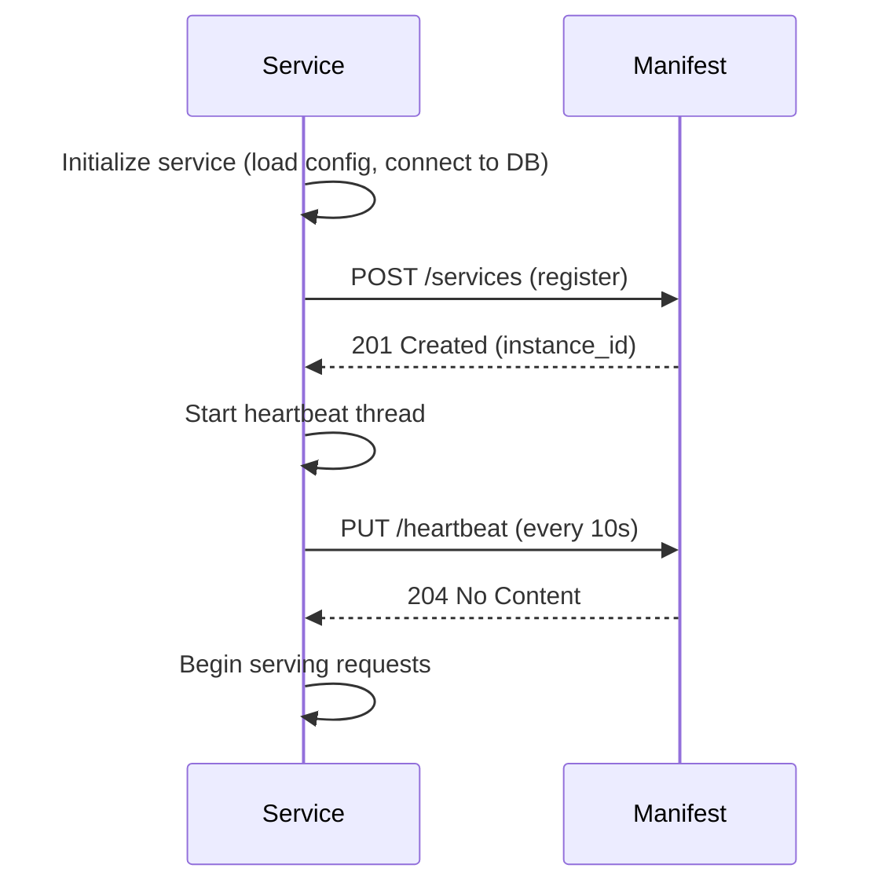
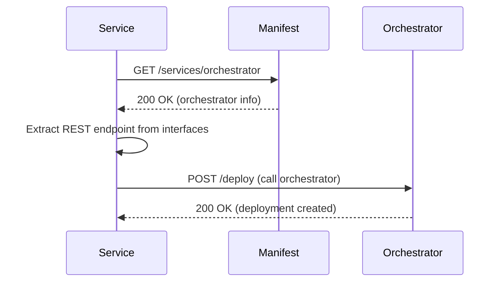
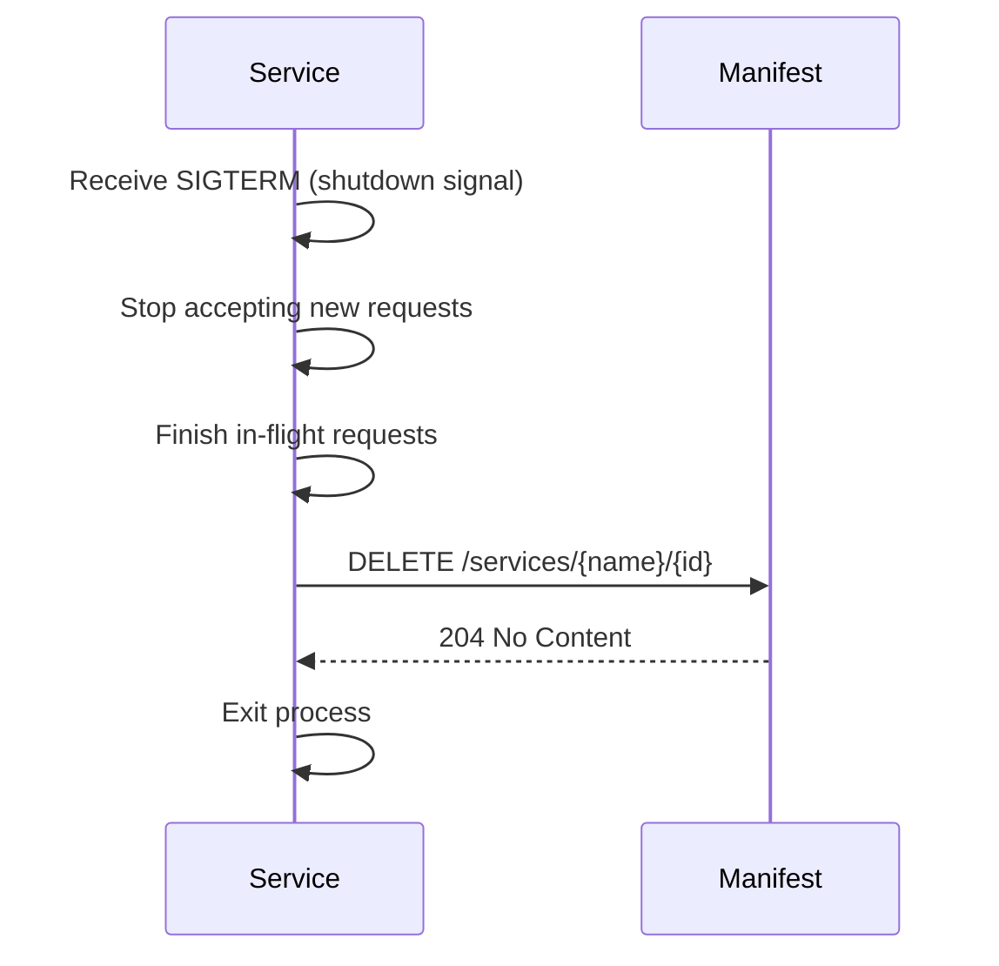

# SAP-044: Registry (Service Discovery and Manifest)
## Quick Reference for AI Agents

**Reading Time**: 6-8 minutes
**Skill Level**: Intermediate
**Prerequisites**: Understanding of REST APIs, basic distributed systems concepts

---

## At a Glance

The **Registry** (Manifest) is a centralized service discovery system for Chora capability servers. It provides:

- **Dynamic Discovery**: Services find each other by name, no hardcoded addresses
- **Health Tracking**: Automatic detection of service failures via heartbeats
- **Rich Metadata**: Interfaces, versions, dependencies, tags for intelligent routing
- **Strong Consistency**: Always returns up-to-date information (no stale data)

**Core Pattern**: Services register on startup → heartbeat every 10s → deregister on shutdown. Clients query registry to discover service endpoints dynamically.

---

## When to Use This SAP

### ✅ Use Registry When:

1. **Multiple Capability Servers**: You have >2 services that need to communicate (orchestrator, gateway, n8n, etc.).
2. **Dynamic Environments**: Services may move, restart, or scale (container-based deployments).
3. **Avoiding Hardcoded Config**: You want to eliminate static configuration (IPs, URLs in environment variables).
4. **Health Monitoring**: You need to know which services are healthy before calling them.
5. **Bootstrapping**: You're setting up a self-provisioning system (services discover dependencies automatically).
6. **Dependency Management**: Services have dependencies that must be validated or started in order.

### ❌ Don't Use Registry When:

1. **Single Service**: Only one standalone service, no inter-service communication needed.
2. **Static Deployment**: Services never move, always have same addresses (rare in modern systems).
3. **Service Mesh Available**: Using Istio/Linkerd which provides service discovery (though Registry can complement).
4. **Overhead Not Justified**: Very simple MVP where hardcoded config is acceptable temporarily.

---

## Quick Start: Integrating a Service with Registry

### 1. Install Client Library

```bash
pip install chora-manifest-client
```

### 2. Register Service on Startup

```python
from chora_manifest_client import ManifestClient

# Initialize client (Manifest URL from environment or config)
manifest_url = os.getenv("MANIFEST_URL", "http://localhost:8500")
client = ManifestClient(manifest_url)

# Register this service
instance_id = client.register(
    name="my-service",
    version="1.0.0",
    interfaces={
        "REST": "http://10.0.0.10:9000",
        "CLI": "my-service-cli",
        "MCP": "tcp://10.0.0.10:7000"
    },
    metadata={
        "description": "My capability server",
        "dependencies": ["manifest", "orchestrator"],
        "tags": ["custom", "production"]
    }
)
print(f"Registered with Manifest: {instance_id}")
```

### 3. Start Heartbeat Loop

```python
from threading import Thread
import time

def heartbeat_loop():
    while True:
        try:
            client.heartbeat("my-service", instance_id)
        except Exception as e:
            print(f"Heartbeat failed: {e}")
        time.sleep(10)  # Every 10 seconds

# Run in background thread
heartbeat_thread = Thread(target=heartbeat_loop, daemon=True)
heartbeat_thread.start()
```

### 4. Discover Other Services

```python
# Find orchestrator's REST endpoint
orchestrator = client.get_service("orchestrator")
orch_url = orchestrator["interfaces"]["REST"]

# Call orchestrator
import requests
response = requests.post(f"{orch_url}/deploy", json={"service": "my-service"})
```

### 5. Deregister on Shutdown

```python
import atexit

def cleanup():
    try:
        client.deregister("my-service", instance_id)
        print("Deregistered from Manifest")
    except Exception as e:
        print(f"Deregistration failed: {e}")

atexit.register(cleanup)
```

**Total Time**: 10-15 minutes to integrate registry into an existing service.

---

## Key Concepts

### 1. Service Records

Each service in the registry has:

- **name**: Unique identifier (e.g., "orchestrator", "gateway")
- **id**: Instance ID for multi-instance support (e.g., "orchestrator-a1b2c3d4")
- **version**: Semantic version (e.g., "1.0.0")
- **interfaces**: Map of interface type → endpoint
  - REST: HTTP(S) URL
  - CLI: Command name
  - MCP: MCP endpoint
- **metadata**: Optional fields
  - description: Human-readable description
  - dependencies: List of services this depends on
  - tags: For filtering/grouping (e.g., ["core", "infrastructure"])
  - environment: "development", "staging", "production"
- **status**: Health state ("up", "down", "unhealthy", "unknown")
- **last_heartbeat**: Timestamp of last heartbeat

### 2. Heartbeat Protocol

**Purpose**: Keep registry informed that service is alive.

**Mechanism**:
- Service sends `PUT /heartbeat` every 10 seconds.
- Registry updates `last_heartbeat` timestamp and resets TTL (30s).
- If no heartbeat for 30s, registry marks service "unhealthy".
- If no heartbeat for 60s, registry removes service entirely.

**Why 10s interval?** Safety margin (3× heartbeats within 30s timeout). Allows 1-2 missed heartbeats before marking unhealthy.

### 3. Health States

| Status | Meaning | Transition |
|--------|---------|-----------|
| **up** | Service actively heartbeating, healthy | Registration → up |
| **unhealthy** | Service registered but missing heartbeats (>30s) | up → unhealthy (after 30s without heartbeat) |
| **down** | Service deregistered or removed | unhealthy → down (explicit deregister OR after 60s total) |
| **unknown** | Special state after Manifest restart | Manifest restart → unknown for all services |

### 4. Dependencies

Services declare dependencies in metadata:

```python
metadata = {
    "dependencies": ["manifest", "orchestrator"]
}
```

**Use Cases**:
- **Startup Ordering**: Bootstrap script or orchestrator uses dependency graph to start services in correct order.
- **Impact Analysis**: If manifest goes down, know that all services depending on it are affected.
- **Health Propagation**: Service can check if dependencies are healthy before starting operations.

**Validation**: Registry can optionally validate dependencies on registration (check if declared dependencies exist). Enable with `MANIFEST_VALIDATE_DEPENDENCIES=true`.

### 5. Discovery Patterns

**Pattern 1: Direct Lookup**

```python
# Get specific service
service = client.get_service("orchestrator")
url = service["interfaces"]["REST"]
```

**Pattern 2: List with Filtering**

```python
# Get all healthy core services
core_services = client.list_services(status="up", tag="core")
for svc in core_services:
    print(f"{svc['name']} - {svc['interfaces']['REST']}")
```

**Pattern 3: Dependency Resolution**

```python
# Find all services that depend on manifest
dependents = client.list_services(dependency="manifest")
```

**Pattern 4: Caching** (for high-frequency lookups)

```python
# Cache service for 60 seconds
@lru_cache(maxsize=128)
def get_orchestrator_url():
    service = client.get_service("orchestrator")
    return service["interfaces"]["REST"]

# Invalidate cache after 60s
import time
cache_time = time.time()
if time.time() - cache_time > 60:
    get_orchestrator_url.cache_clear()
    cache_time = time.time()
```

---

## Common Workflows

### Workflow 1: Service Startup



**Steps**:
1. Service initializes internal state
2. Register with Manifest (get instance_id)
3. Start heartbeat loop in background
4. Begin normal operations

### Workflow 2: Discovering and Calling Another Service



**Steps**:
1. Query Manifest for target service
2. Extract appropriate interface endpoint (REST, CLI, MCP)
3. Call target service using discovered endpoint

### Workflow 3: Graceful Shutdown



**Steps**:
1. Catch shutdown signal (SIGTERM, SIGINT)
2. Stop accepting new requests (close HTTP server)
3. Complete in-flight requests (grace period, e.g., 30s)
4. Deregister from Manifest
5. Exit cleanly

### Workflow 4: Health Check Before Calling

```python
# Check if dependency is healthy before operation
orchestrator = client.get_service("orchestrator")

if orchestrator["status"] != "up":
    raise RuntimeError("Orchestrator is unhealthy, cannot proceed")

# Safe to call
url = orchestrator["interfaces"]["REST"]
response = requests.post(f"{url}/deploy", ...)
```

---

## Integration Checklist

Use this checklist when integrating a service with Registry:

### Essential (Required)

- [ ] **Install client library**: `pip install chora-manifest-client`
- [ ] **Register on startup**: Call `client.register()` with name, version, interfaces
- [ ] **Start heartbeat**: Background thread/coroutine sending heartbeat every 10s
- [ ] **Deregister on shutdown**: Use `atexit.register()` or signal handler to call `client.deregister()`
- [ ] **Discover dependencies**: Query Manifest for services you need to call
- [ ] **Handle discovery errors**: Catch `ServiceNotFoundError`, implement fallback or retry logic

### Recommended

- [ ] **Declare dependencies**: Include `metadata.dependencies` list for orchestration
- [ ] **Add tags**: Tag service with category (e.g., "core", "storage", "compute")
- [ ] **Specify environment**: Set `metadata.environment` for filtering by env
- [ ] **Health check before calls**: Verify dependency status before calling
- [ ] **Error handling**: Gracefully handle heartbeat failures (log but don't crash)
- [ ] **Metrics**: Track heartbeat success rate, discovery latency

### Advanced

- [ ] **Cache discovery results**: Use `@lru_cache` or TTL cache for frequently-queried services
- [ ] **Watch for changes**: Subscribe to Manifest updates (WebSocket/SSE) for real-time discovery
- [ ] **Validate dependencies**: Enable dependency validation on registration
- [ ] **Multi-interface support**: Register all interfaces (REST, CLI, MCP) for flexibility
- [ ] **HA heartbeat**: Use multiple threads/processes with separate instance_ids for HA deployments
- [ ] **Audit logging**: Log all registration, deregistration, discovery events for observability

---

## Common Patterns

### Pattern 1: Service Factory

**Problem**: Multiple services need to initialize Manifest client with same config.

**Solution**: Create factory function.

```python
# config.py
import os

def create_manifest_client():
    """Factory for Manifest client with standard config."""
    manifest_url = os.getenv("MANIFEST_URL", "http://localhost:8500")
    auth_token = os.getenv("MANIFEST_AUTH_TOKEN")

    return ManifestClient(
        manifest_url=manifest_url,
        auth_token=auth_token,
        timeout=5.0,
        retries=3
    )

# my_service.py
from config import create_manifest_client

client = create_manifest_client()
```

### Pattern 2: Heartbeat Manager (Async)

**Problem**: Need robust heartbeat handling with retries and error logging.

**Solution**: Use heartbeat manager class.

```python
import asyncio
import logging

class HeartbeatManager:
    def __init__(self, client, service_name, instance_id, interval=10):
        self.client = client
        self.service_name = service_name
        self.instance_id = instance_id
        self.interval = interval
        self.running = False

    async def start(self):
        self.running = True
        asyncio.create_task(self._heartbeat_loop())

    async def stop(self):
        self.running = False
        await self.client.deregister_async(self.service_name, self.instance_id)

    async def _heartbeat_loop(self):
        consecutive_failures = 0
        while self.running:
            try:
                await self.client.heartbeat_async(self.service_name, self.instance_id)
                consecutive_failures = 0
            except Exception as e:
                consecutive_failures += 1
                logging.warning(f"Heartbeat failed ({consecutive_failures}): {e}")
                if consecutive_failures >= 3:
                    logging.error("Multiple heartbeat failures, may be deregistered soon")

            await asyncio.sleep(self.interval)

# Usage
manager = HeartbeatManager(client, "my-service", instance_id)
await manager.start()
# ... later ...
await manager.stop()
```

### Pattern 3: Dependency Resolver

**Problem**: Service depends on multiple others, need to discover all at startup.

**Solution**: Resolve dependencies before starting.

```python
def resolve_dependencies(client, dependencies):
    """Resolve all dependencies, raise error if any missing."""
    resolved = {}
    for dep_name in dependencies:
        try:
            dep_service = client.get_service(dep_name)
            if dep_service["status"] != "up":
                raise RuntimeError(f"Dependency '{dep_name}' is not healthy (status: {dep_service['status']})")
            resolved[dep_name] = dep_service
        except ServiceNotFoundError:
            raise RuntimeError(f"Dependency '{dep_name}' not found in registry")
    return resolved

# On startup
dependencies = resolve_dependencies(client, ["manifest", "orchestrator", "gateway"])
orch_url = dependencies["orchestrator"]["interfaces"]["REST"]
gateway_url = dependencies["gateway"]["interfaces"]["REST"]
```

### Pattern 4: Service Proxy

**Problem**: Multiple places in code need to call same service, want to abstract discovery.

**Solution**: Create proxy class that handles discovery internally.

```python
class OrchestratorProxy:
    def __init__(self, manifest_client):
        self.client = manifest_client
        self._url_cache = None
        self._cache_time = 0

    def _get_url(self):
        """Get orchestrator URL with caching."""
        now = time.time()
        if self._url_cache and (now - self._cache_time) < 60:
            return self._url_cache

        service = self.client.get_service("orchestrator")
        self._url_cache = service["interfaces"]["REST"]
        self._cache_time = now
        return self._url_cache

    def deploy(self, service_name, config):
        """Deploy service via orchestrator."""
        url = self._get_url()
        response = requests.post(f"{url}/deploy", json={
            "service": service_name,
            "config": config
        })
        response.raise_for_status()
        return response.json()

    def list_deployments(self):
        """List all deployments."""
        url = self._get_url()
        response = requests.get(f"{url}/deployments")
        response.raise_for_status()
        return response.json()

# Usage
orch = OrchestratorProxy(client)
deployment = orch.deploy("my-service", {"replicas": 3})
all_deployments = orch.list_deployments()
```

---

## Common Pitfalls

### ❌ Pitfall 1: Not Starting Heartbeat

**Problem**: Service registers but never sends heartbeats. After 30s, marked unhealthy and removed.

**Symptom**: Service works fine internally, but Manifest shows it as "unhealthy" or missing.

**Fix**: Always start heartbeat loop immediately after registration.

```python
# ❌ Bad: Register but no heartbeat
instance_id = client.register(...)
# Service starts serving requests, but Manifest doesn't know it's alive

# ✅ Good: Register + start heartbeat
instance_id = client.register(...)
heartbeat_thread = Thread(target=heartbeat_loop, daemon=True)
heartbeat_thread.start()
```

### ❌ Pitfall 2: Ignoring Heartbeat Failures

**Problem**: Heartbeat fails (network issue, Manifest down), but service continues as if nothing happened. Eventually deregistered.

**Symptom**: Service works but disappears from Manifest, other services can't discover it.

**Fix**: Log heartbeat failures, alert if multiple consecutive failures.

```python
# ❌ Bad: Silently ignore errors
try:
    client.heartbeat(name, instance_id)
except:
    pass  # Ignoring error

# ✅ Good: Log and track failures
consecutive_failures = 0
try:
    client.heartbeat(name, instance_id)
    consecutive_failures = 0
except Exception as e:
    consecutive_failures += 1
    logging.warning(f"Heartbeat failed ({consecutive_failures}): {e}")
    if consecutive_failures >= 3:
        logging.error("Multiple heartbeat failures - service may be deregistered!")
        # Optionally: alert monitoring system
```

### ❌ Pitfall 3: Hardcoding Service Addresses

**Problem**: Service registers with Manifest but also hardcodes addresses of other services in config, defeating the purpose of registry.

**Symptom**: When other service moves, this service breaks despite registry having correct address.

**Fix**: Always discover addresses from Manifest, never hardcode.

```python
# ❌ Bad: Hardcoded address
ORCHESTRATOR_URL = "http://10.0.0.1:8600"  # What if orchestrator moves?
response = requests.post(f"{ORCHESTRATOR_URL}/deploy", ...)

# ✅ Good: Discover from Manifest
orchestrator = client.get_service("orchestrator")
url = orchestrator["interfaces"]["REST"]
response = requests.post(f"{url}/deploy", ...)
```

### ❌ Pitfall 4: Not Deregistering on Shutdown

**Problem**: Service exits without deregistering. Manifest keeps showing it as "up" until heartbeat timeout (30s). Other services try to call it and fail.

**Symptom**: Phantom services in Manifest for 30-60s after shutdown.

**Fix**: Always deregister in shutdown handler.

```python
# ❌ Bad: No deregistration
sys.exit(0)  # Service exits, Manifest still thinks it's up

# ✅ Good: Deregister before exit
import atexit

def cleanup():
    client.deregister(service_name, instance_id)

atexit.register(cleanup)

# Also handle signals
import signal
def signal_handler(sig, frame):
    cleanup()
    sys.exit(0)

signal.signal(signal.SIGTERM, signal_handler)
signal.signal(signal.SIGINT, signal_handler)
```

### ❌ Pitfall 5: Querying Manifest on Every Request

**Problem**: Service queries Manifest for dependency address on every incoming request. High latency, overloads Manifest.

**Symptom**: Slow request processing, Manifest shows high query load.

**Fix**: Cache discovery results with TTL (e.g., 60 seconds).

```python
# ❌ Bad: Query on every request
@app.post("/process")
def process_request(data):
    orchestrator = client.get_service("orchestrator")  # Querying Manifest every time!
    url = orchestrator["interfaces"]["REST"]
    # ...

# ✅ Good: Cache with TTL
from functools import lru_cache
import time

_cache_time = time.time()

@lru_cache(maxsize=128)
def get_orchestrator_url():
    return client.get_service("orchestrator")["interfaces"]["REST"]

@app.post("/process")
def process_request(data):
    global _cache_time
    # Invalidate cache every 60s
    if time.time() - _cache_time > 60:
        get_orchestrator_url.cache_clear()
        _cache_time = time.time()

    url = get_orchestrator_url()  # Cached lookup
    # ...
```

### ❌ Pitfall 6: Not Handling ServiceNotFoundError

**Problem**: Service tries to discover dependency that doesn't exist yet (race condition during startup). Crashes instead of retrying.

**Symptom**: Service fails to start if dependencies not ready yet.

**Fix**: Retry discovery with exponential backoff.

```python
# ❌ Bad: Crash if dependency not found
orchestrator = client.get_service("orchestrator")  # Raises ServiceNotFoundError if not registered yet

# ✅ Good: Retry with backoff
import time

def discover_with_retry(client, service_name, max_retries=10, initial_delay=1):
    """Discover service with exponential backoff."""
    delay = initial_delay
    for attempt in range(max_retries):
        try:
            return client.get_service(service_name)
        except ServiceNotFoundError:
            if attempt == max_retries - 1:
                raise
            logging.info(f"Service '{service_name}' not found, retrying in {delay}s... ({attempt+1}/{max_retries})")
            time.sleep(delay)
            delay = min(delay * 2, 30)  # Cap at 30s

orchestrator = discover_with_retry(client, "orchestrator")
```

---

## Best Practices Summary

### ✅ Do:

1. **Register Early**: Register with Manifest as soon as service is initialized, before serving requests.
2. **Heartbeat Reliably**: Use background thread/coroutine, handle errors gracefully, log failures.
3. **Deregister Cleanly**: Always deregister on shutdown using `atexit` or signal handlers.
4. **Discover Dynamically**: Query Manifest for all service addresses, never hardcode.
5. **Cache Wisely**: Cache discovery results for 30-60s to reduce Manifest load, but not longer (stale data risk).
6. **Declare Dependencies**: Include metadata.dependencies for orchestration and impact analysis.
7. **Handle Errors**: Catch `ServiceNotFoundError`, retry with backoff during startup.
8. **Validate Health**: Check `status == "up"` before calling discovered services.
9. **Use Tags**: Tag services for filtering (e.g., "core", "storage", "compute").
10. **Monitor Metrics**: Track heartbeat success rate, discovery latency, registry availability.

### ❌ Don't:

1. **Don't Skip Heartbeats**: Missing heartbeats = service marked unhealthy and removed.
2. **Don't Ignore Errors**: Silently ignoring heartbeat failures can cause deregistration.
3. **Don't Hardcode Addresses**: Defeats purpose of registry, creates brittle dependencies.
4. **Don't Query Every Request**: Cache discovery results to avoid overloading Manifest.
5. **Don't Forget Deregistration**: Phantom services confuse other services and monitoring.
6. **Don't Block Main Thread**: Run heartbeat loop in background (thread/coroutine).
7. **Don't Assume Synchronous Startup**: Dependencies may not be ready immediately, retry discovery.
8. **Don't Use Stale Cache**: Refresh cache every 60s, or listen to Manifest updates.
9. **Don't Over-Depend**: If Manifest temporarily unavailable, use cached addresses or fallback.
10. **Don't Register Without Interfaces**: Must provide at least one interface (REST, CLI, or MCP).

---

## Integration with Other SAPs

### SAP-042 (InterfaceDesign)

- **Relationship**: Registry stores interface endpoints declared by SAP-042 (contract-first design).
- **Pattern**: Service defines interfaces in OpenAPI spec → registers endpoints with Manifest → clients discover and validate compatibility.

### SAP-043 (MultiInterface)

- **Relationship**: Registry's `interfaces` field supports multi-interface pattern (Native, CLI, REST, MCP).
- **Pattern**: Service implements 4 interfaces → registers all 4 endpoints → clients choose appropriate interface.

```python
# Service registers all interfaces
client.register(
    name="orchestrator",
    interfaces={
        "REST": "http://10.0.0.1:8600",
        "CLI": "chora-orch",
        "MCP": "tcp://10.0.0.1:7000",
        "Native": "python:orchestrator.service.OrchestratorService"
    }
)

# Client chooses interface
orch = client.get_service("orchestrator")
if ai_agent:
    mcp_endpoint = orch["interfaces"]["MCP"]  # Use MCP for AI agent
elif cli_user:
    cli_cmd = orch["interfaces"]["CLI"]  # Use CLI for human
else:
    rest_url = orch["interfaces"]["REST"]  # Use REST for programmatic access
```

### SAP-045 (Bootstrap)

- **Relationship**: Registry is first service started in bootstrap (Phase 1). All other services register with it.
- **Pattern**: Bootstrap starts Manifest → verifies health → starts other services → they register → bootstrap confirms via Manifest query.

### SAP-046 (Composition)

- **Relationship**: Orchestrator uses Registry to discover capability servers before composing workflows.
- **Pattern**: Workflow requires [orchestrator, gateway, n8n] → orchestrator queries Manifest for each → verifies all healthy → executes workflow.

---

## Quick Reference: Client Library API

```python
from chora_manifest_client import ManifestClient

# Initialize
client = ManifestClient(manifest_url="http://localhost:8500", auth_token="optional")

# Register service
instance_id = client.register(
    name="service-name",
    version="1.0.0",
    interfaces={"REST": "http://...", "CLI": "cmd"},
    metadata={"dependencies": [...], "tags": [...]}
)

# Send heartbeat
client.heartbeat(name="service-name", instance_id=instance_id)

# Deregister service
client.deregister(name="service-name", instance_id=instance_id)

# Get service by name
service = client.get_service(name="orchestrator")
# Returns: {"name": "orchestrator", "id": "...", "interfaces": {...}, "status": "up", ...}

# List all services
services = client.list_services(status="up", tag="core")
# Returns: [{"name": "manifest", ...}, {"name": "orchestrator", ...}]

# Async versions (for async/await)
instance_id = await client.register_async(...)
await client.heartbeat_async(...)
service = await client.get_service_async(...)
```

---

## Troubleshooting

### Issue: "Service not found" error when querying

**Symptom**: `ServiceNotFoundError` when calling `client.get_service(name)`.

**Causes**:
1. Service never registered (check if `POST /services` was called)
2. Service deregistered (check if graceful shutdown happened)
3. Service removed due to missed heartbeats (check heartbeat loop)
4. Typo in service name (check spelling)

**Debug Steps**:
```python
# List all services to see what's registered
all_services = client.list_services()
print([s["name"] for s in all_services])

# Check Manifest health
health = requests.get("http://localhost:8500/v1/health").json()
print(health)
```

### Issue: Service marked "unhealthy" despite working fine

**Symptom**: Service is running and responding, but Manifest shows `status: "unhealthy"`.

**Causes**:
1. Heartbeat loop not running (thread crashed, coroutine stopped)
2. Heartbeat failures (network issues, Manifest overloaded)
3. Clock skew between service and Manifest (last_heartbeat timestamp mismatch)

**Debug Steps**:
```python
# Check heartbeat is running
import logging
logging.basicConfig(level=logging.DEBUG)
# Look for "Heartbeat failed" logs

# Manually test heartbeat
try:
    client.heartbeat(name, instance_id)
    print("Heartbeat succeeded")
except Exception as e:
    print(f"Heartbeat failed: {e}")
```

### Issue: Manifest not responding / connection timeout

**Symptom**: `requests.exceptions.ConnectionError` when calling Manifest API.

**Causes**:
1. Manifest service not running (check process/container)
2. Wrong Manifest URL (check `MANIFEST_URL` environment variable)
3. Network issue (firewall, DNS)
4. Manifest crashed or overloaded

**Debug Steps**:
```bash
# Check Manifest health endpoint
curl http://localhost:8500/v1/health

# Check Manifest logs
docker logs manifest

# Check network connectivity
ping <manifest-host>
telnet <manifest-host> 8500
```

---

## Example: Complete Service Integration

```python
#!/usr/bin/env python3
"""
Example capability server with full Registry integration.
"""

import os
import time
import signal
import sys
from threading import Thread
from chora_manifest_client import ManifestClient

# Configuration
SERVICE_NAME = "example-service"
SERVICE_VERSION = "1.0.0"
MANIFEST_URL = os.getenv("MANIFEST_URL", "http://localhost:8500")
REST_URL = "http://0.0.0.0:9000"

# Global state
client = None
instance_id = None
heartbeat_running = True

def heartbeat_loop():
    """Background heartbeat loop."""
    global heartbeat_running
    consecutive_failures = 0

    while heartbeat_running:
        try:
            client.heartbeat(SERVICE_NAME, instance_id)
            consecutive_failures = 0
            print(f"[Heartbeat] Sent successfully")
        except Exception as e:
            consecutive_failures += 1
            print(f"[Heartbeat] Failed ({consecutive_failures}): {e}")
            if consecutive_failures >= 3:
                print("[Heartbeat] Multiple failures - may be deregistered!")

        time.sleep(10)

def shutdown_handler(sig, frame):
    """Handle graceful shutdown."""
    global heartbeat_running

    print(f"\n[Shutdown] Received signal {sig}, shutting down gracefully...")

    # Stop heartbeat
    heartbeat_running = False
    time.sleep(1)  # Wait for heartbeat thread to exit

    # Deregister
    try:
        client.deregister(SERVICE_NAME, instance_id)
        print(f"[Shutdown] Deregistered from Manifest")
    except Exception as e:
        print(f"[Shutdown] Failed to deregister: {e}")

    sys.exit(0)

def main():
    global client, instance_id

    # Setup signal handlers
    signal.signal(signal.SIGTERM, shutdown_handler)
    signal.signal(signal.SIGINT, shutdown_handler)

    # Initialize Manifest client
    print(f"[Init] Connecting to Manifest at {MANIFEST_URL}")
    client = ManifestClient(manifest_url=MANIFEST_URL)

    # Register service
    print(f"[Init] Registering service '{SERVICE_NAME}'...")
    instance_id = client.register(
        name=SERVICE_NAME,
        version=SERVICE_VERSION,
        interfaces={
            "REST": REST_URL,
            "CLI": f"{SERVICE_NAME}-cli"
        },
        metadata={
            "description": "Example capability server",
            "dependencies": ["manifest"],
            "tags": ["example", "demo"]
        }
    )
    print(f"[Init] Registered with instance ID: {instance_id}")

    # Start heartbeat thread
    print("[Init] Starting heartbeat thread...")
    heartbeat_thread = Thread(target=heartbeat_loop, daemon=True)
    heartbeat_thread.start()

    # Discover dependencies
    print("[Init] Discovering dependencies...")
    try:
        manifest_service = client.get_service("manifest")
        print(f"[Init] Found Manifest at {manifest_service['interfaces']['REST']}")
    except Exception as e:
        print(f"[Init] Failed to discover Manifest: {e}")

    # Start serving (simulated)
    print(f"[Server] Service is ready and running on {REST_URL}")
    print("[Server] Press Ctrl+C to shut down")

    # Keep alive
    try:
        while True:
            time.sleep(1)
    except KeyboardInterrupt:
        shutdown_handler(signal.SIGINT, None)

if __name__ == "__main__":
    main()
```

**Output**:
```
[Init] Connecting to Manifest at http://localhost:8500
[Init] Registering service 'example-service'...
[Init] Registered with instance ID: example-service-a1b2c3d4
[Init] Starting heartbeat thread...
[Init] Discovering dependencies...
[Init] Found Manifest at http://localhost:8500
[Server] Service is ready and running on http://0.0.0.0:9000
[Server] Press Ctrl+C to shut down
[Heartbeat] Sent successfully
[Heartbeat] Sent successfully
^C
[Shutdown] Received signal 2, shutting down gracefully...
[Shutdown] Deregistered from Manifest
```

---

## Further Reading

- **Capability Charter**: [capability-charter.md](./capability-charter.md) - Problem statement, solution design, ROI
- **Protocol Specification**: [protocol-spec.md](./protocol-spec.md) - Complete REST API, data model, implementation details
- **Adoption Blueprint**: [adoption-blueprint.md](./adoption-blueprint.md) - Step-by-step integration guide with phases
- **Ledger**: [ledger.md](./ledger.md) - Adoption metrics, feedback, version history

---

## Quick Tips

💡 **Tip 1**: Start with Essential tier (register + heartbeat + discover). Add metadata and caching later.

💡 **Tip 2**: Use `MANIFEST_URL` environment variable for flexibility (dev: localhost, prod: manifest.chora.svc).

💡 **Tip 3**: Test registry integration early in development. Don't wait until deployment.

💡 **Tip 4**: Monitor heartbeat success rate as key metric. >99% = healthy, <95% = investigate.

💡 **Tip 5**: For HA, run multiple instances with different instance_ids, same service name. Registry returns list of instances, client chooses (round-robin, load-based, etc.).

---

**Last Updated**: 2025-11-12
**Version**: 1.0.0
**Next Review**: 2025-12-12
