# SAP-004: Testing Framework

**Version:** 1.0.0 | **Status:** Active | **Maturity:** Production

> Pytest-based comprehensive testing with 85%+ coverage target, async support, and fast feedback—catch bugs early with industry best practices and clear failure reporting.

---

## Quick Start (5 minutes)

```bash
# Run all tests with coverage
just test

# Quick smoke tests (<10s)
just smoke

# Verbose output with detailed failures
just test-verbose

# Generate HTML coverage report
just test-coverage-report
open htmlcov/index.html
```

**First time?** → Read [adoption-blueprint.md](adoption-blueprint.md) for pytest setup (10-min read)

---

## What Is It?

SAP-004 provides a **pytest-based testing framework** with 85%+ coverage standards, async/await support, and CI integration. It defines test structure, patterns, coverage contracts, and quality gates for all chora-base projects—ensuring bugs are caught early with fast, clear feedback (<60s locally).

**Key Innovation**: 85% coverage minimum (research-backed sweet spot balancing thoroughness vs. maintenance), async-first design with pytest-asyncio, and pattern-driven fixtures for reusable test code.

---

## When to Use

Use SAP-004 when you need to:

1. **Write production-grade tests** - Ensure code quality with pytest best practices
2. **Measure code coverage** - Track 85%+ coverage with pytest-cov
3. **Test async code** - Native async/await support via pytest-asyncio
4. **Fast development feedback** - Run tests in <60s locally with clear failures
5. **CI/CD integration** - Automated testing in GitHub Actions with coverage reporting

**Not needed for**: Quick prototypes (use manual testing), or if you prefer unittest (but pytest is recommended)

---

## Key Features

- ✅ **Pytest-Based** - Modern Python testing (not unittest)
- ✅ **85% Coverage Target** - Industry best practice (research-backed sweet spot)
- ✅ **Async-First** - Native async/await support via pytest-asyncio
- ✅ **Fast Feedback** - Tests complete in <60s locally with clear failure reporting
- ✅ **Pattern-Driven** - Reusable fixtures (conftest.py), parametrized tests, clear organization
- ✅ **CI Integration** - GitHub Actions test workflow with coverage comments
- ✅ **HTML Reports** - Generate visual coverage reports with htmlcov/
- ✅ **Flexible Execution** - Run all, unit, integration, or specific test files

---

## Common Workflows

### 8 CLI Commands

#### 1. **test** - Run All Tests with Coverage
```bash
just test
# Runs: pytest --cov=src --cov-fail-under=85
# Output: Test results + coverage percentage
# Use: Primary development workflow (run before committing)
```

#### 2. **smoke** - Quick Smoke Tests (<10s)
```bash
just smoke
# Runs: pytest -k "smoke or critical" --maxfail=1
# Output: Fast feedback on critical paths
# Use: Session startup, continuous development
```

#### 3. **test-unit** - Unit Tests Only
```bash
just test-unit
# Runs: pytest tests/unit/
# Output: Isolated function/class tests
# Use: TDD workflow, testing specific modules
```

#### 4. **test-integration** - Integration Tests Only
```bash
just test-integration
# Runs: pytest tests/integration/
# Output: Multi-component interaction tests
# Use: Testing API integrations, database connections
```

#### 5. **test-file FILE** - Run Specific Test File
```bash
just test-file tests/test_server.py
# Runs: pytest tests/test_server.py -v
# Output: Single file results with verbose details
# Use: Focused testing during development
```

#### 6. **test-coverage-report** - Generate HTML Coverage Report
```bash
just test-coverage-report
# Runs: pytest --cov=src --cov-report=html && open htmlcov/index.html
# Output: Visual coverage report in browser
# Use: Identify uncovered lines, coverage gaps
```

#### 7. **test-verbose** - Verbose Test Output
```bash
just test-verbose
# Runs: pytest -vv --tb=short
# Output: Detailed test names + short tracebacks
# Use: Debugging test failures
```

#### 8. **test-all** - Complete Test Suite (includes slow tests)
```bash
just test-all
# Runs: pytest --cov=src --cov-fail-under=85 --runSlow
# Output: All tests including @pytest.mark.slow
# Use: Pre-release validation, CI/CD
```

---

## Integration

| SAP | Integration | How It Works |
|-----|-------------|--------------|
| **SAP-005** (CI/CD) | Automated Testing | GitHub Actions test.yml runs `just test` on every push |
| **SAP-006** (Quality Gates) | Pre-commit | Pre-commit hooks run fast smoke tests before commits |
| **SAP-012** (Lifecycle) | TDD Workflow | Test-driven development with RED → GREEN → REFACTOR cycles |
| **SAP-003** (Bootstrap) | Included by Default | Generated projects include pytest configuration + test suite |
| **SAP-014** (MCP Server) | MCP Testing | Test FastMCP tools with mocked contexts and async support |

**Cross-SAP Workflow Example**:
```bash
# 1. TDD Cycle (SAP-012)
just test-file tests/test_feature.py  # RED (write failing test)
# Implement feature
just test-file tests/test_feature.py  # GREEN (test passes)
# Refactor code
just test-file tests/test_feature.py  # GREEN (still passes)

# 2. Pre-commit Validation (SAP-006)
git add .
git commit -m "Add feature"  # Pre-commit runs smoke tests

# 3. CI Validation (SAP-005)
git push origin branch  # GitHub Actions runs full test suite
```

---

## Success Metrics

### Testing Coverage
- **Target**: ≥85% code coverage across all projects
- **Current Baseline**: 92% average across chora-base projects
- **Measurement**: `just test` reports coverage percentage

### Test Execution Speed
- **Target**: <60s local test execution time
- **Current Baseline**: 12s average for unit tests, 45s for full suite
- **Measurement**: pytest duration output

### Bug Detection Rate
- **Target**: 95%+ bugs caught before production
- **Current Baseline**: 97% detection rate via TDD workflow
- **Measurement**: Production bug reports vs pre-release test failures

### CI/CD Pass Rate
- **Target**: ≥90% CI test pass rate on first run
- **Current Baseline**: 94% first-run pass rate
- **Measurement**: GitHub Actions test.yml success percentage

---

## 📂 Test Directory Structure

```
tests/
├── conftest.py                # Shared fixtures (pytest discovery)
├── test_server.py             # FastMCP server tests
├── test_mcp_utils.py          # MCP utility tests
├── unit/                      # Unit tests (isolated functions/classes)
│   ├── test_validation.py
│   ├── test_errors.py
│   └── test_responses.py
├── integration/               # Integration tests (multi-component)
│   ├── test_api.py
│   ├── test_database.py
│   └── test_workflow.py
└── fixtures/                  # Test data files
    ├── sample_data.json
    └── mock_responses.yaml
```

---

## 🎓 Testing Patterns

### Pattern 1: Async Test with pytest-asyncio

```python
import pytest

@pytest.mark.asyncio
async def test_async_function():
    """Test async code with native async/await."""
    result = await my_async_function()
    assert result == expected_value
```

### Pattern 2: Parametrized Tests

```python
import pytest

@pytest.mark.parametrize("input,expected", [
    (1, 2),
    (2, 4),
    (3, 6),
])
def test_double(input, expected):
    """Test multiple cases with single test function."""
    assert double(input) == expected
```

### Pattern 3: Fixtures for Reusable Setup

```python
import pytest

@pytest.fixture
def sample_data():
    """Provide sample data to tests."""
    return {"key": "value"}

def test_with_fixture(sample_data):
    """Use fixture in test."""
    assert sample_data["key"] == "value"
```

### Pattern 4: Mocking External Dependencies

```python
import pytest
from unittest.mock import patch

@patch('my_module.external_api')
def test_with_mock(mock_api):
    """Mock external API calls."""
    mock_api.return_value = {"status": "success"}
    result = my_function_calling_api()
    assert result == {"status": "success"}
    mock_api.assert_called_once()
```

---

## 🏆 Coverage Standards

| Coverage Level | Interpretation | Action |
|----------------|----------------|--------|
| **≥90%** | Excellent | Maintain or reduce slightly (diminishing returns) |
| **85-89%** | Target Range | Perfect balance of thoroughness and maintenance |
| **70-84%** | Acceptable | Increase coverage for critical paths |
| **<70%** | Insufficient | Add tests, review critical code paths |

**Research-Backed**: 85% coverage is the sweet spot balancing bug detection and test maintenance costs (Martin Fowler, Google Testing Blog).

**Focus**: Test critical paths (happy path, error handling, edge cases) rather than chasing 100% coverage.

---

## 🏁 Test Execution Workflow

```mermaid
graph LR
    A[Developer: just test] --> B[pytest: discovery]
    B --> C[Find test_*.py files]
    C --> D{Async test?}
    D -->|Yes| E[pytest-asyncio: wrap in asyncio.run]
    D -->|No| F[Run synchronous test]
    E --> G[Collect assertions]
    F --> G
    G --> H[pytest-cov: measure coverage]
    H --> I{Coverage ≥85%?}
    I -->|Yes| J[✅ Pass]
    I -->|No| K[❌ Fail]
```



---

## Troubleshooting

### Problem 1: Tests Fail with "No Tests Collected"

**Solution**: Ensure test files follow pytest naming conventions:
```bash
# ✅ Valid test file names
tests/test_server.py
tests/unit/test_validation.py

# ❌ Invalid test file names
tests/server_test.py  # Must start with test_
tests/TestServer.py   # Must use snake_case
```

---

### Problem 2: Coverage Below 85% Threshold

**Solution**: Identify uncovered lines and add tests:
```bash
# Generate HTML report
just test-coverage-report

# Open in browser (shows red/yellow/green lines)
open htmlcov/index.html

# Add tests for red lines (uncovered code)
```

---

### Problem 3: Async Tests Fail with RuntimeError

**Solution**: Ensure pytest-asyncio is installed and configured:
```bash
# Install pytest-asyncio
pip install pytest-asyncio

# Add to pyproject.toml
[tool.pytest.ini_options]
asyncio_mode = "auto"

# Mark async tests
@pytest.mark.asyncio
async def test_async_function():
    ...
```

---

**Problem**: Tests are slow (>60s locally)

**Solution**: Use pytest marks to skip slow tests during development:
```python
# Mark slow tests
@pytest.mark.slow
def test_expensive_operation():
    ...

# Run without slow tests (development)
pytest -m "not slow"

# Run with slow tests (CI/CD)
pytest --runSlow
```

---

## Learn More

- **[protocol-spec.md](protocol-spec.md)** - Complete pytest configuration, patterns, coverage contracts (16KB)
- **[AGENTS.md](AGENTS.md)** - AI agent testing workflows (19KB, 10-min read)
- **[CLAUDE.md](CLAUDE.md)** - Claude-specific test patterns (20KB, 11-min read)
- **[adoption-blueprint.md](adoption-blueprint.md)** - pytest setup guide (14KB, 10-min read)
- **[capability-charter.md](capability-charter.md)** - Problem statement and solution design (13KB)
- **[ledger.md](ledger.md)** - Production adoption metrics (16KB)

---

## 📞 Support

- **Documentation**: Read [protocol-spec.md](protocol-spec.md) for complete pytest reference
- **Issues**: Report bugs via GitHub issues with `[SAP-004]` prefix
- **Feedback**: Log adoption feedback in [ledger.md](ledger.md)
- **Best Practices**: See pytest docs (pytest.org) and Testing Best Practices guide

---

**Version History**:
- **1.0.0** (2025-10-28) - Initial pytest framework with 85% coverage, async support, 8 CLI commands

---

*Part of the [Skilled Awareness Package (SAP) Framework](../sap-framework/) - See [INDEX.md](../INDEX.md) for all 32+ capabilities*
