# SAP Set Decision Tree

**Quick Start Guide**: Choose the right SAP set in under 5 minutes

**Last Updated**: 2025-10-30
**Part of**: COORD-003 Sprint 1 onboarding improvements

---

## Visual Decision Tree

```mermaid
graph TD
    Start[🚀 Choose Your SAP Set] --> Q1{First-time adopter?<br/>New to chora-base?}

    Q1 -->|Yes| MinimalEntry[✨ minimal-entry<br/>5 SAPs · 3-5 hours<br/>Essential ecosystem entry]
    Q1 -->|No| Q2{What's your<br/>primary goal?}

    Q2 --> Testing{🧪 Testing &<br/>Quality Focus?}
    Q2 --> MCP{🔌 MCP Server<br/>Development?}
    Q2 --> Production{🏭 Production<br/>Project?}
    Q2 --> Everything{📚 Want ALL<br/>capabilities?}

    Testing -->|Yes| TestingFocused[🧪 testing-focused<br/>6 SAPs · 4-6 hours<br/>pytest, coverage, quality gates]

    MCP -->|Yes| MCPServer[🔌 mcp-server<br/>10 SAPs · 1 day<br/>FastMCP, server patterns]

    Production -->|Yes| Recommended[⭐ recommended<br/>10 SAPs · 1-2 days<br/>Production-ready foundation]

    Everything -->|Yes| Full[🎯 full<br/>18 SAPs · 2-4 weeks<br/>Complete capability suite]

    MinimalEntry -.Next Step.-> Upgrade[Can upgrade later by<br/>installing additional SAPs]
    TestingFocused -.Next Step.-> Upgrade
    MCPServer -.Next Step.-> Upgrade
    Recommended -.Next Step.-> Upgrade

    style MinimalEntry fill:#90EE90
    style TestingFocused fill:#87CEEB
    style MCPServer fill:#DDA0DD
    style Recommended fill:#FFD700
    style Full fill:#FF6347
    style Start fill:#4682B4,color:#fff
```



---

## Quick Reference Table

| SAP Set | SAP Count | Time | Best For | Start Here? |
|---------|-----------|------|----------|-------------|
| **minimal-entry** | 5 | 3-5 hours | First-timers, cross-repo coordination | ✅ **YES** |
| **testing-focused** | 6 | 4-6 hours | Quality-first development, CI/CD | For testing projects |
| **mcp-server** | 10 | ~1 day | Building MCP servers with FastMCP | For MCP development |
| **recommended** | 10 | 1-2 days | Production-ready projects, full workflow | After minimal-entry |
| **full** | 18 | 2-4 weeks | Complete reference, all capabilities | Advanced users only |

---

## Decision Questions

### Question 1: Is this your first time with chora-base?

**YES → Use `minimal-entry`**

- **Why**: Gets you productive in 3-5 hours without overwhelming you
- **What you get**: Essential ecosystem coordination + SAP framework basics
- **Next steps**: Add individual SAPs as needed or upgrade to `recommended`

**NO → Continue to Question 2**

---

### Question 2: What's your primary goal?

#### Goal A: Testing & Quality Focus

**→ Use `testing-focused`**

- **Includes**: pytest framework, coverage enforcement (85%+), async testing, 6 test patterns
- **SAPs**: SAP-000, SAP-003, SAP-004, SAP-005, SAP-006, SAP-016
- **Time**: 4-6 hours
- **Perfect for**: Projects emphasizing test-driven development and quality gates

#### Goal B: MCP Server Development

**→ Use `mcp-server`**

- **Includes**: FastMCP patterns, server scaffolding, testing, CI/CD for MCP servers
- **SAPs**: 10 SAPs including SAP-014 (MCP server), SAP-015 (FastMCP patterns)
- **Time**: ~1 day
- **Perfect for**: Building Model Context Protocol servers

#### Goal C: Production-Ready Project

**→ Use `recommended`**

- **Includes**: Full development lifecycle from bootstrapping to deployment
- **SAPs**: 10 core SAPs covering testing, CI/CD, documentation, project structure
- **Time**: 1-2 days
- **Perfect for**: Standalone projects, production deployments, professional workflows

#### Goal D: I Want Everything / Complete Reference

**→ Use `full`**

- **Includes**: All 18 SAPs - every capability chora-base offers
- **Time**: 2-4 weeks (comprehensive)
- **Perfect for**: Deep exploration, reference implementation, contributing to chora-base itself
- **Warning**: Large investment - most users don't need this

---

## Detailed SAP Set Comparison

### minimal-entry (5 SAPs)

**SAPs Included**:
- SAP-000: SAP Framework & Protocols
- SAP-001: Inbox Coordination Protocol ⚠️ *Pilot*
- SAP-002: Chora-Base Meta Package
- SAP-009: Agent Awareness (AGENTS.md)
- SAP-016: Link Validation

**Capabilities**:
- ✅ SAP framework understanding
- ✅ Cross-repo coordination via inbox protocol
- ✅ Agent awareness documentation
- ✅ Documentation quality (link validation)
- ✅ Understand chora-base architecture

**Use Cases**:
- First-time chora ecosystem adoption
- Contributing to ecosystem repos via inbox protocol
- Cross-repo coordination
- Lightweight onboarding before full adoption

**Estimated Investment**:
- **Tokens**: ~29,000 tokens
- **Time**: 3-5 hours
- **Complexity**: Low

**Next Steps**:
- Add domain-specific SAP (SAP-004 for testing, SAP-014 for MCP)
- Upgrade to `recommended` set for full productivity
- Customize AGENTS.md for your project

**⚠️ Note**: SAP-001 (inbox-coordination) is in Pilot status and may undergo changes

---

### testing-focused (6 SAPs)

**SAPs Included**:
- SAP-000: SAP Framework
- SAP-003: Project Bootstrap
- SAP-004: Testing Framework (pytest, 85%+ coverage)
- SAP-005: Python Type Checking
- SAP-006: Continuous Integration (GitHub Actions)
- SAP-016: Link Validation

**Capabilities**:
- ✅ pytest configuration with async support
- ✅ 85%+ coverage enforcement
- ✅ 6 test pattern templates
- ✅ Type checking with mypy/pyright
- ✅ GitHub Actions CI/CD
- ✅ Quality gates and automation

**Use Cases**:
- Quality-first development
- Test-driven development (TDD)
- CI/CD pipeline setup
- Projects requiring high test coverage

**Estimated Investment**:
- **Tokens**: ~35,000 tokens
- **Time**: 4-6 hours
- **Complexity**: Medium

**Perfect For**: Teams prioritizing quality, test coverage, and automated workflows

---

### mcp-server (10 SAPs)

**SAPs Included**:
- All testing-focused SAPs (SAP-000, SAP-003, SAP-004, SAP-005, SAP-006, SAP-016)
- SAP-007: Documentation Framework (Sphinx, MkDocs)
- SAP-008: Deployment Patterns (Docker, Railway, Render)
- SAP-014: MCP Server Implementation
- SAP-015: FastMCP Patterns

**Capabilities**:
- ✅ All testing-focused capabilities
- ✅ FastMCP server patterns
- ✅ MCP protocol implementation
- ✅ Docker containerization for MCP servers
- ✅ Deployment to Railway/Render
- ✅ Documentation generation

**Use Cases**:
- Building Model Context Protocol (MCP) servers
- FastMCP-based tool development
- Deploying MCP servers to cloud platforms
- Creating Claude Desktop integrations

**Estimated Investment**:
- **Tokens**: ~55,000 tokens
- **Time**: ~1 day
- **Complexity**: Medium-High

**Perfect For**: MCP server developers, Claude Desktop tool creators

---

### recommended (10 SAPs)

**SAPs Included**:
- All minimal-entry SAPs (SAP-000, SAP-001, SAP-002, SAP-009, SAP-016)
- SAP-003: Project Bootstrap
- SAP-004: Testing Framework
- SAP-005: Python Type Checking
- SAP-006: Continuous Integration
- SAP-007: Documentation Framework

**Capabilities**:
- ✅ All minimal-entry capabilities
- ✅ Full development lifecycle support
- ✅ Testing + CI/CD + Documentation
- ✅ Project scaffolding and templates
- ✅ Production-ready patterns

**Use Cases**:
- Standalone projects built on chora-base
- Full development lifecycle support
- Production-ready projects
- Professional software development

**Estimated Investment**:
- **Tokens**: ~60,000 tokens
- **Time**: 1-2 days
- **Complexity**: Medium

**Perfect For**: Most users after completing minimal-entry

---

### full (18 SAPs)

**SAPs Included**: All 18 SAPs

**Additional SAPs beyond recommended**:
- SAP-008: Deployment Patterns
- SAP-010: SDLC-Flow (8-phase workflow)
- SAP-011: RAG Applications
- SAP-012: Monitoring & Observability
- SAP-013: Agentic Workflows
- SAP-014: MCP Server Implementation
- SAP-015: FastMCP Patterns
- SAP-017: Chora Compose (Multi-SAP packages)
- SAP-018: Traceability & Governance

**Capabilities**: Everything chora-base offers

**Use Cases**:
- Comprehensive coverage of chora-base capabilities
- Reference implementation
- Contributing to chora-base itself
- Deep exploration of all patterns

**Estimated Investment**:
- **Tokens**: ~100,000 tokens
- **Time**: 2-4 weeks
- **Complexity**: High

**⚠️ Warnings**:
- Very large investment - most users don't need this
- Some SAPs are in Pilot/Draft status
- Best reserved for chora-base contributors or comprehensive evaluations

---

## Common Scenarios

### Scenario 1: "I just want to try chora-base"

**Recommendation**: `minimal-entry`

**Why**: 3-5 hour investment gets you:
- Understanding of SAP framework
- Ability to use inbox protocol for coordination
- Foundation for deciding if chora-base fits your needs

**Next Steps**: After completing minimal-entry, re-evaluate based on your experience

---

### Scenario 2: "I'm building a production Python project"

**Recommendation**: `minimal-entry` → `recommended`

**Path**:
1. Start with `minimal-entry` (3-5 hours) to understand SAP framework
2. Upgrade to `recommended` (adds +1 day) for full development lifecycle
3. You'll have: testing, CI/CD, documentation, deployment patterns

---

### Scenario 3: "I need to build an MCP server for Claude Desktop"

**Recommendation**: `mcp-server`

**Why**: Specifically curated for MCP server development with:
- FastMCP patterns and examples
- Deployment guides for Railway/Render
- Testing patterns for MCP servers
- Docker containerization

---

### Scenario 4: "I'm contributing to an ecosystem repo via inbox protocol"

**Recommendation**: `minimal-entry`

**Why**: Includes SAP-001 (inbox-coordination) which is all you need for:
- Submitting coordination requests
- Understanding capability registry
- Cross-repo collaboration

---

### Scenario 5: "I'm evaluating chora-base for my team"

**Recommendation**: `minimal-entry` → `testing-focused` or `recommended`

**Path**:
1. **Individual evaluation**: Start with `minimal-entry` (3-5 hours)
2. **Team pilot**: Upgrade to `testing-focused` (if quality-focused) or `recommended` (if full-stack)
3. **Assessment**: After 1-2 weeks, decide on full adoption or specific SAPs

---

## Can I Change Later?

**YES! SAP sets are additive and non-exclusive.**

### Adding Individual SAPs

Install additional SAPs anytime:
```bash
python3 scripts/install-sap.py SAP-004  # Add testing framework
python3 scripts/install-sap.py SAP-007  # Add documentation framework
```

### Upgrading to a Different Set

Install another SAP set (won't reinstall existing SAPs):
```bash
# Started with minimal-entry, now want recommended
python3 scripts/install-sap.py --set recommended

# The installer skips SAPs you already have
```

### Checking What's Installed

```bash
ls docs/skilled-awareness/ | grep SAP-
```

---

## Installation Commands

### Pre-Flight Check (Run First!)

```bash
bash scripts/validate-prerequisites.sh
```

### Dry-Run (See What Will Happen)

```bash
python3 scripts/install-sap.py --set minimal-entry --dry-run
```

### Install Your Chosen Set

```bash
# minimal-entry (recommended for first-timers)
python3 scripts/install-sap.py --set minimal-entry

# testing-focused
python3 scripts/install-sap.py --set testing-focused

# mcp-server
python3 scripts/install-sap.py --set mcp-server

# recommended
python3 scripts/install-sap.py --set recommended

# full (advanced)
python3 scripts/install-sap.py --set full
```

### List All Available Sets

```bash
python3 scripts/install-sap.py --list-sets
```

---

## Still Not Sure?

### Default Recommendation

**When in doubt, start with `minimal-entry`.**

**Why**:
- Smallest time investment (3-5 hours)
- Covers essentials for ecosystem participation
- You can always add more SAPs later
- Low risk, high learning value

### Get Help

- **Decision paralysis?** Read the [Onboarding FAQ](../troubleshooting/onboarding-faq.md#which-sap-set-should-i-choose)
- **Want more details?** See [SAP Index](../../skilled-awareness/INDEX.md) for complete SAP catalog
- **Questions?** Open an issue: https://github.com/org/chora-base/issues

---

## Validation After Installation

### Success Criteria

After installation, verify:

1. **SAP count matches**:
   ```bash
   ls -d docs/skilled-awareness/SAP-* | wc -l
   # Should match your chosen set's SAP count
   ```

2. **Each SAP has 5 artifacts**:
   ```bash
   ls docs/skilled-awareness/SAP-000-sap-framework/
   # Should see: BLUEPRINT.md, INDEX.md, AGENTS.md, README.md, SPECIFICATION.md
   ```

3. **Can read a SAP**:
   ```bash
   cat docs/skilled-awareness/SAP-000-sap-framework/README.md
   # Should display without errors
   ```

### Troubleshooting

If installation failed or validation fails, see:
- [Onboarding FAQ](../troubleshooting/onboarding-faq.md) - Common issues and solutions
- Run pre-flight validator: `bash scripts/validate-prerequisites.sh`

---

## Quick Decision Flowchart (Text Version)

```
START: Choose SAP Set
│
├─ Are you new to chora-base?
│  ├─ YES → minimal-entry (5 SAPs, 3-5 hours) ✅ START HERE
│  └─ NO → Continue...
│
├─ What's your primary goal?
│  │
│  ├─ Testing & Quality → testing-focused (6 SAPs, 4-6 hours)
│  │
│  ├─ MCP Server Development → mcp-server (10 SAPs, ~1 day)
│  │
│  ├─ Production Project → recommended (10 SAPs, 1-2 days)
│  │
│  └─ Want Everything → full (18 SAPs, 2-4 weeks)
│
└─ Can upgrade or add individual SAPs anytime!
```

---

**Next Steps**:
1. Run pre-flight check: `bash scripts/validate-prerequisites.sh`
2. Choose your SAP set using this decision tree
3. Run dry-run: `python3 scripts/install-sap.py --set [your-choice] --dry-run`
4. Install: `python3 scripts/install-sap.py --set [your-choice]`
5. Verify installation (see [Validation After Installation](#validation-after-installation))

**Helpful Resources**:
- [Onboarding FAQ](../troubleshooting/onboarding-faq.md)
- [SAP Index](../../skilled-awareness/INDEX.md)
- [Installation Guide](../installation-guide.md)
- [Adoption Blueprints](../../skilled-awareness/adoption-blueprint-minimal-entry.md)
